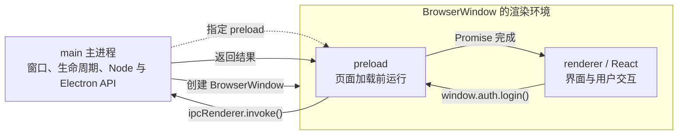
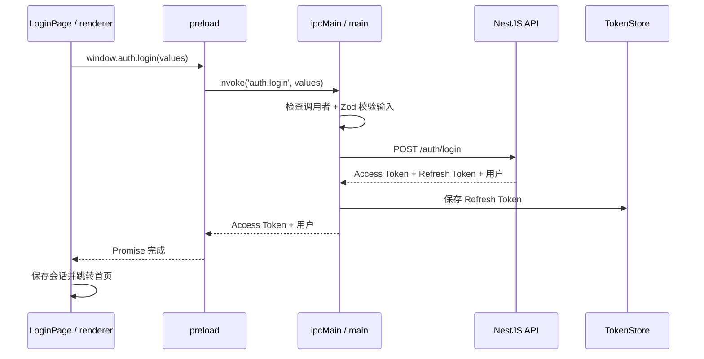

# Photo Lab Electron 项目解析

## 1. Electron 项目为什么同时有 main、preload 和 renderer <a id="processes"></a>

### 1.1 先从常见的 Electron 应用说起

Electron 官网列出的应用包括 VS Code、Slack、Discord、Notion、Postman 等。它们的界面很像 Web 应用，但又能作为桌面软件安装、创建原生窗口并使用操作系统能力。

这里先抛出一个问题：

> React 可以画出界面，但创建桌面窗口、访问本地文件、注册全局快捷键、执行系统命令的代码应该运行在哪里？

如果页面直接拥有全部系统权限，页面脚本一旦出现漏洞，风险也会直接扩大到用户电脑。Electron 因此不会让所有代码都挤在 React 页面中，而是把高权限能力和页面界面分开。

官方应用列表：[Apps built with Electron](https://www.electronjs.org/)。

### 1.2 先看它们在项目里的位置

Photo Lab 的桌面端不是只有一个 React 入口。与 Electron 直接相关的代码分布在三个位置：

```text
apps/desktop/
├── electron/main.ts       Electron 桌面端入口
├── electron/preload.ts    页面加载前运行的脚本
└── src/main.tsx           React 页面入口
```

- [`electron/main.ts`](../apps/desktop/electron/main.ts#L1-L88) 先启动，负责创建桌面窗口；
- [`electron/preload.ts`](../apps/desktop/electron/preload.ts#L1-L18) 随窗口配置，在 React 之前运行；
- [`src/main.tsx`](../apps/desktop/src/main.tsx#L26-L40) 最后把 React 页面挂载到 HTML。

它们不是三个并列的应用，执行关系是：

```text
main 启动
  → 创建 BrowserWindow
  → 运行这个窗口的 preload
  → 加载 HTML 和 React
```

### 1.3 为什么不能把代码全部写在 React 里

React 擅长显示页面和处理用户操作，但 Electron 还要创建原生窗口、保存本地凭据、调用文件系统等。这些能力的权限比普通网页高得多。

如果 React 页面直接拥有全部 Node.js 和 Electron 权限，页面脚本一旦被注入，攻击代码也会得到相同权限。这个项目因此把代码分成两种权限范围：

- main 持有窗口、Node.js 和 Electron 原生 API 等高权限；
- renderer 只负责 React 组件、路由、表单和 DOM。

renderer 确实需要桌面能力时，不直接取得整个 Electron，而是调用 preload 提供的少量方法。preload 在这里负责限定“页面可以请求什么”。

### 1.4 三者怎样连起来

IPC 是“进程间通信”。在这个项目里，React 通过 preload 发出 IPC 请求，main 接收并处理：



| 位置     | 当前项目负责的事情                  | 典型代码                                  |
| -------- | ----------------------------------- | ----------------------------------------- |
| main     | 创建窗口、认证请求、保存敏感凭据    | `BrowserWindow`、`ipcMain`、`safeStorage` |
| preload  | 把固定 IPC 方法暴露为 `window.auth` | `contextBridge`、`ipcRenderer`            |
| renderer | 显示 React 页面并调用 `window.auth` | React、DOM、`LoginPage`                   |

preload **不是第三个操作系统进程**。它运行在 `BrowserWindow` 的渲染进程中，只是比页面更早执行，并且与 React 使用隔离的 JavaScript 环境。第三章会直接对应到项目代码。

从代码内容也能判断它属于哪里：

- 组件、DOM、点击事件通常在 renderer；
- `app`、`BrowserWindow`、文件系统和安全存储在 main；
- `contextBridge` 和 `ipcRenderer` 在 preload。

官方对应阅读：[Electron 进程模型](https://www.electronjs.org/zh/docs/latest/tutorial/process-model)。

---

## 2. 应用怎么启动：从 ready 到窗口出现 <a id="startup"></a>

### 2.1 Electron 为什么不能立刻创建窗口

**现在的问题：** Electron 模块被加载时，操作系统的桌面能力可能还没有准备完成。此时调用窗口 API 可能失败。

**项目怎样解决：** 等待 `app.whenReady()`，再按顺序准备主进程状态、注册 IPC、创建窗口。

项目代码在 [`main.ts`](../apps/desktop/electron/main.ts#L71-L82)：

```ts
void app.whenReady().then(() => {
  const tokenStore = new TokenStore();
  registerAuthIpc(tokenStore);
  createWindow();

  app.on('activate', () => {
    if (BrowserWindow.getAllWindows().length === 0) {
      createWindow();
    }
  });
});
```

**运行时实际发生了什么：**

1. Electron 通知主进程“桌面环境准备好了”；
2. main 创建负责保管 Refresh Token 的 `TokenStore`；
3. main 注册四个接收认证请求的函数，也就是 IPC handler；
4. main 调用 `createWindow()`；
5. macOS 用户重新点击 Dock 图标且没有窗口时，再创建一个窗口。

`registerAuthIpc()` 特意放在 `createWindow()` 前面。这样页面开始运行时，接收请求的 handler 已经存在。

**写错会怎样：**

- ready 之前使用窗口 API，可能创建失败；
- 先显示页面、后注册 IPC，页面过早调用时可能得到“没有 handler”的错误；
- 每创建一个窗口就重复注册 `ipcMain.handle()`，会产生重复 handler 错误。

### 2.2 `new BrowserWindow()` 解决什么

**现在的问题：** React 构建产物只是 HTML、CSS 和 JavaScript，它自己不会变成 macOS 或 Windows 窗口。

**项目怎样解决：** main 使用 `BrowserWindow` 创建原生窗口，并告诉它尺寸、页面入口和安全边界。

完整构造代码在 [`main.ts`](../apps/desktop/electron/main.ts#L17-L32)：

```ts
const mainWindow = new BrowserWindow({
  backgroundColor: '#f7f8fa',
  height: 760,
  minHeight: 640,
  minWidth: 960,
  show: false,
  title: 'Photo Lab',
  webPreferences: {
    contextIsolation: true,
    nodeIntegration: false,
    preload: join(__dirname, '../preload/preload.cjs'),
    sandbox: true,
  },
  width: 1180,
});
```

这段代码不是单纯设置窗口外观。`webPreferences` 同时规定了 React 页面能获得多少权限。

| 配置                     | 它解决什么                           | 删除或改错的表现                 |
| ------------------------ | ------------------------------------ | -------------------------------- |
| `width`、`height`        | 设置首次打开尺寸                     | 使用系统默认尺寸，工作区可能太小 |
| `minWidth`、`minHeight`  | 防止窗口缩到布局无法使用             | 用户可能把表单和工作台挤坏       |
| `backgroundColor`        | React 首次绘制前先显示接近页面的底色 | 容易短暂闪出白色背景             |
| `title`                  | 设置原生标题栏文字                   | 使用页面标题或应用默认名称       |
| `show: false`            | 等首屏准备好后再展示                 | 窗口可能先出现半成品页面         |
| `preload`                | 指定页面加载前运行的桥接脚本         | `window.auth` 不会被创建         |
| `contextIsolation: true` | 分开 preload 与页面的全局环境        | 改成 `false` 会削弱权限隔离      |
| `nodeIntegration: false` | 禁止 React 直接使用 Node.js          | 改成 `true` 会明显扩大页面权限   |
| `sandbox: true`          | 进一步限制渲染环境的系统能力         | 改成 `false` 会失去一层隔离      |

当前 Electron 对后三项已有安全默认值，但项目仍显式写出，目的是让代码审查时一眼看见安全意图。不要为了少写三行而删掉它们。

这些配置要和后面的代码连起来看：

- `show: false` 对应 [`ready-to-show` 后再 `show()`](../apps/desktop/electron/main.ts#L34-L36)；
- `preload` 对应 [`preload.ts` 中暴露 `window.auth`](../apps/desktop/electron/preload.ts#L4-L18)；
- `contextIsolation: true` 对应使用 `contextBridge`，而不是直接修改页面的 `window`；
- `nodeIntegration: false` 和 `sandbox: true` 决定 React 不能绕过 preload 直接使用高权限 API。

所以 `BrowserWindow` 不只是“创建一个壳”。它同时决定页面从哪里加载、页面显示前是什么状态，以及 renderer 与系统能力之间的权限边界。

### 2.3 窗口为什么不是创建完就结束了

创建窗口后，main 还做了四件事。

第一，等待首屏绘制后再显示：

```ts
mainWindow.once('ready-to-show', () => {
  mainWindow.show();
});
```

对应 [`main.ts` 第 34–36 行](../apps/desktop/electron/main.ts#L34-L36)。它与 `show: false` 配套，解决的是首次打开闪烁问题，不是安全问题。

第二，阻止窗口跳到非项目页面，并拒绝页面自行打开新窗口：

```ts
mainWindow.webContents.on('will-navigate', (event, targetUrl) => {
  if (!isTrustedNavigation(targetUrl, rendererUrl, rendererEntryUrl)) {
    event.preventDefault();
  }
});

mainWindow.webContents.setWindowOpenHandler(() => ({ action: 'deny' }));
```

对应 [`main.ts` 第 38–46 行](../apps/desktop/electron/main.ts#L38-L46)。`will-navigate` 防止当前窗口跳到外部页面；`setWindowOpenHandler` 拒绝创建新窗口。两者分别守住当前窗口和弹窗入口。

第三，开发和生产加载不同入口：

```ts
if (rendererUrl) {
  void mainWindow.loadURL(rendererUrl);
} else {
  void mainWindow.loadFile(rendererEntryPath);
}
```

对应 [`main.ts` 第 48–52 行](../apps/desktop/electron/main.ts#L48-L52)。开发时加载 Vite 地址以支持热更新；生产构建加载本地 HTML。

第四，处理应用退出。Windows 和 Linux 关闭全部窗口后退出；macOS 通常让应用继续留在 Dock。项目代码在 [`main.ts` 第 84–88 行](../apps/desktop/electron/main.ts#L84-L88)。

### 2.4 项目没用，但经常会看到的配置

这里只认识名字，不展开背诵：

| 配置                         | 什么时候才需要                           |
| ---------------------------- | ---------------------------------------- |
| `frame`、`titleBarStyle`     | 自定义标题栏或无边框窗口                 |
| `parent`、`modal`            | 创建设置框、确认框等父子窗口             |
| `alwaysOnTop`                | 悬浮工具窗口                             |
| `webPreferences.partition`   | 隔离不同账号的 Cookie 和缓存             |
| `webPreferences.webviewTag`  | 嵌入独立网页；默认关闭，开启会扩大攻击面 |
| `webPreferences.webSecurity` | 控制同源策略；不要为了绕过 CORS 而关闭   |

需要其他选项时再查 [`BrowserWindow` 完整配置](https://www.electronjs.org/zh/docs/latest/api/browser-window#new-browserwindowoptions)，不要把整张 API 表复制进项目。

---

## 3. 页面为什么不能直接调用 Electron <a id="preload"></a>

### 3.1 React 想登录，为什么还需要 preload

**现在的问题：** React 需要让主进程执行认证请求，但安全配置已经禁止页面直接取得 `ipcRenderer`、Node.js 和其他 Electron 能力。

一个偷懒做法是开启 `nodeIntegration`，让页面什么都能用。这样一旦页面出现 XSS，攻击代码也可能获得文件系统等高权限，所以项目没有这么做。

**项目怎样解决：** preload 只开放四个认证方法。下面摘出登录方法和真正的暴露动作，完整代码在 [`preload.ts`](../apps/desktop/electron/preload.ts#L4-L18)：

```ts
const authApi: DesktopAuthApi = {
  login: (input) =>
    ipcRenderer.invoke(authIpcChannels.login, input) as ReturnType<DesktopAuthApi['login']>,
  // register、refreshSession、logoutSession 结构相同
};

contextBridge.exposeInMainWorld('auth', authApi);
```

这段代码解决的事情可以用一句话说清楚：

> React 可以请求“登录”，但拿不到可以任意发送消息的 `ipcRenderer`。

页面最终只看见 `window.auth` 上的 `login()`、`register()`、`refreshSession()`、`logoutSession()`。它看不见 `BrowserWindow`、`safeStorage`，也不能自己选择第五个 IPC channel。

### 3.2 “preload 不是第三个进程”体现在代码哪里

这句话不是由某一行代码声明的，而是 Electron 对 `webPreferences.preload` 的运行规则。项目代码负责配置和使用这条规则，可以分五步对应。

**第一，preload 是绑定在窗口上的脚本。**

[`new BrowserWindow()` 的配置](../apps/desktop/electron/main.ts#L17-L32)把它放在 `webPreferences` 中：

```ts
webPreferences: {
  contextIsolation: true,
  nodeIntegration: false,
  preload: join(__dirname, '../preload/preload.cjs'),
  sandbox: true,
},
```

这里没有创建新的后台进程，而是告诉这个 `BrowserWindow`：加载页面时，先运行指定的 preload。preload 因而属于该窗口的渲染环境。

**第二，preload 比 React 页面更早运行。**

main 先创建带有 preload 配置的窗口，之后才在 [`main.ts` 第 48–52 行](../apps/desktop/electron/main.ts#L48-L52)调用 `loadURL()` 或 `loadFile()` 加载页面。Electron 会在页面脚本之前执行 preload，因此它能先把 `window.auth` 准备好。

**第三，preload 和 React 使用隔离的 JavaScript 全局环境。**

对应的开关就是 [`contextIsolation: true`](../apps/desktop/electron/main.ts#L24-L30)。因此 preload 不能依靠普通的 `window.auth = ...` 把对象交给 React，而要使用 `contextBridge`。

**第四，preload 只交出少量、明确的方法。**

[`preload.ts` 第 4–18 行](../apps/desktop/electron/preload.ts#L4-L18)只建立四个认证方法，最后执行：

```ts
contextBridge.exposeInMainWorld('auth', authApi);
```

这句话的结果是页面得到 `window.auth`，而不是得到完整的 `ipcRenderer` 或 Node.js。

**第五，React 最终只使用桥接后的接口。**

登录页没有导入 Electron，而是在 [`LoginPage.tsx` 第 15–19 行](../apps/desktop/src/pages/LoginPage.tsx#L15-L19)调用：

```ts
return window.auth.login(values);
```

把它们连起来就是：

```text
BrowserWindow 指定 preload
  → preload 先运行
  → contextBridge 安装 window.auth
  → React 调用 window.auth.login()
  → preload 再通过 IPC 请求 main
```

preload 源码会被 Electron Vite 构建为 `preload.cjs`，对应[构建配置](../apps/desktop/electron.vite.config.ts#L27-L37)。所以 `main.ts` 填的是构建后路径，不是源码路径。

TypeScript 还需要知道 `window.auth` 的类型。项目在 [`vite-env.d.ts`](../apps/desktop/src/vite-env.d.ts#L3-L8) 中声明它，但要注意：

> 类型声明不会创建 `window.auth`。真正创建它的是 `contextBridge`。

### 3.3 三个安全设置不是一回事

| 设置                     | 通俗解释                                     | 它不能替代什么                |
| ------------------------ | -------------------------------------------- | ----------------------------- |
| `nodeIntegration: false` | React 页面不能直接使用 Node.js               | 不能替代 preload 的窄接口     |
| `contextIsolation: true` | preload 和页面看到不同的 JavaScript 全局对象 | 不能保证你暴露的 API 一定安全 |
| `sandbox: true`          | 渲染环境受到更严格的系统能力限制             | 不能替代 main 对 IPC 的校验   |

上下文隔离开启后，preload 里的 `window` 和 React 看到的 `window` 不是同一个 JavaScript 全局对象。直接写 `window.auth = ...` 时，React 所在的页面环境看不到这次赋值，因此要使用 `contextBridge`。

沙盒限制的是渲染环境能接触的系统能力。main 本身仍有高权限，所以 main 收到页面请求后必须继续检查调用者和参数，不能因为“请求来自自己写的 React”就直接相信。

### 3.4 写错以后通常看到什么

| 现象                          | 最先检查                                           |
| ----------------------------- | -------------------------------------------------- |
| `window.auth` 是 `undefined`  | preload 路径是否正确，`exposeInMainWorld` 是否执行 |
| TypeScript 提示 `auth` 不存在 | `vite-env.d.ts` 是否扩展了 `Window`                |
| `invoke()` 报没有 handler     | main 是否注册了同名 `ipcMain.handle()`             |
| 开发环境正常，构建后失败      | `preload.cjs` 和 renderer 构建路径是否正确         |
| 页面可以发送任意 channel      | 是否错误地暴露了整个 `ipcRenderer`                 |

项目采用的原则是“一种能力，一个方法”：`login()` 只负责登录，`logoutSession()` 只负责退出。不要暴露 `send(channel, args)` 这种万能入口。

官方对应阅读：[什么是 preload](https://www.electronjs.org/zh/docs/latest/tutorial/tutorial-preload#什么是预加载脚本)、[上下文隔离](https://www.electronjs.org/zh/docs/latest/tutorial/context-isolation#上下文隔离是什么)、[Electron 中的沙盒](https://www.electronjs.org/zh/docs/latest/tutorial/sandbox#electron-中的沙盒行为)。

---

## 4. 登录怎样跨进程完成 <a id="ipc"></a>

这一章只追登录这一条真实链路。

### 4.1 先看完整时序



整条链可以压缩成一句话：

> React 表达登录意图，preload 把意图送到固定 channel，main 验证后访问后端，并只把页面需要的结果返回。

### 4.2 第一步：React 只表达“我要登录”

登录页代码在 [`LoginPage.tsx`](../apps/desktop/src/pages/LoginPage.tsx#L15-L19)：

```ts
const mutation = useMutation({
  mutationFn: async (values: LoginFormValues) => {
    return window.auth.login(values);
  },
});
```

**这段代码解决什么：** UI 只负责收集表单并表达登录意图，不负责决定请求在哪个进程发送，也不接触 Refresh Token。

**运行时发生什么：** `window.auth.login()` 返回 Promise，React Query 等待它完成。成功后，页面保存 Access Token 和用户并跳转，代码在 [`LoginPage.tsx` 第 27–34 行](../apps/desktop/src/pages/LoginPage.tsx#L27-L34)。

### 4.3 第二步：preload 把函数调用变成 IPC

preload 的核心是：

```ts
login: (input) => ipcRenderer.invoke(authIpcChannels.login, input);
```

**这段代码解决什么：** `window.auth.login()` 看起来像普通异步函数，但真正工作在 main。`invoke()` 负责把参数跨进程送出，并把 main 的返回值变回 Promise 结果。

`authIpcChannels.login` 的实际值是 `auth.login`，集中定义在 [`auth.channels.ts`](../apps/desktop/electron/ipc/auth.channels.ts#L24-L30)。两端共用常量，避免一边写 `auth.login`、另一边误写 `auth:login`。

channel 名只是地址，不是权限。安全性来自 preload 的窄接口、main 的调用者检查和输入校验。

### 4.4 第三步：main 接住请求，但不会立刻相信它

main 使用与 `invoke()` 配对的 `ipcMain.handle()`：

```ts
ipcMain.handle(
  authIpcChannels.login,
  async (event, input: unknown): Promise<DesktopAuthSession> => {
    assertTrustedSender(event);
    return createSession(sessionCoordinator, '/auth/login', loginInputSchema.parse(input));
  },
);
```

真实代码在 [`auth.ipc.ts`](../apps/desktop/electron/ipc/auth.ipc.ts#L25-L32)。

**这段代码解决什么：** main 不直接相信 renderer 传来的页面来源和参数，检查通过后才执行登录。

main 做两次检查：

1. [`assertTrustedSender()`](../apps/desktop/electron/ipc/auth.ipc.ts#L93-L105) 确认请求来自可信窗口最外层页面，而不是 iframe；
2. [`loginInputSchema.parse()`](../apps/desktop/electron/auth/auth-input-schemas.ts#L4-L12) 在运行时验证邮箱和密码。

TypeScript 类型在编译后会消失，所以 IPC 参数仍然声明为 `unknown`。只写 `input: DesktopLoginInput` 不能阻止运行时传入错误对象。

### 4.5 第四步：main 请求后端并处理两种 Token

校验通过后，`createSession()` 调用主进程里的 `postJson()`：

```ts
const session = await sessionCoordinator.createSession(() =>
  postJson<AuthApiSession>(path, body, authSessionSchema),
);

return {
  accessToken: session.accessToken,
  user: session.user,
};
```

代码在 [`auth.ipc.ts`](../apps/desktop/electron/ipc/auth.ipc.ts#L53-L67)，真正的 `fetch` 在 [`auth-api-client.ts`](../apps/desktop/electron/auth/auth-api-client.ts#L15-L40)。

**这段代码解决什么：** 后端同时返回 Access Token 和 Refresh Token，但 React 不需要拿到长期凭据。main 保存 Refresh Token，返回前重新构造对象，只留下 Access Token 和用户信息。

[`TokenStore`](../apps/desktop/electron/token-store.ts#L5-L35) 的行为是：

- 当前进程中先保存在 main 内存；
- 只有 `app.isPackaged` 时才尝试用 `safeStorage` 加密写盘；
- 加密持久化失败不会让登录失败，只是下次启动需要重新登录。

准确说法是“Refresh Token 不会跨 IPC 返回 React”，而不是“Refresh Token 永远只在磁盘”。Access Token 仍在 renderer 内存中，因此 CSP 和防 XSS 依然重要。

### 4.6 四个认证 channel 是同一个模式

| Channel               | 页面想做什么   | main 最终做什么                           |
| --------------------- | -------------- | ----------------------------------------- |
| `auth.login`          | 登录           | 请求 `/auth/login`，保存 Refresh Token    |
| `auth.register`       | 注册并登录     | 请求 `/auth/register`，保存 Refresh Token |
| `auth.refreshSession` | 恢复或刷新会话 | 用 main 保存的 Refresh Token 换新会话     |
| `auth.logoutSession`  | 退出           | 通知后端并清除本机 Refresh Token          |

它们都使用 `ipcRenderer.invoke()` + `ipcMain.handle()`，因为页面需要知道操作成功还是失败。

### 4.7 先判断 IPC 的通信方向

遇到桌面功能时，先回答三个问题：

1. 谁发起操作：renderer 还是 main？
2. 发起方是否需要等待一个结果？
3. 操作过程中是否还要持续推送进度或事件？

答案对应三种最常见的 IPC 组合：

| 需求                               | 数据方向                   | preload / main 使用的 API                   |
| ---------------------------------- | -------------------------- | ------------------------------------------- |
| renderer 单向通知 main，不等待结果 | Renderer → Main            | `ipcRenderer.send()` → `ipcMain.on()`       |
| renderer 请求 main，并等待一个结果 | Renderer → Main → Renderer | `ipcRenderer.invoke()` → `ipcMain.handle()` |
| main 主动通知 renderer             | Main → Renderer            | `webContents.send()` → `ipcRenderer.on()`   |

`invoke/handle` 常被称为“双向”，更准确地说是 **renderer 发起的一次请求—响应**：main 的返回值会让 renderer 得到的 Promise 完成。它不适合持续不断地发送进度。

在当前安全配置下，React 不直接使用 `ipcRenderer`。表中的 `ipcRenderer.send()`、`invoke()` 和 `on()` 都应先在 preload 中包装成 `window.xxx` 上的具体方法。

官方对应阅读：[Electron IPC 的三种基础模式](https://www.electronjs.org/zh/docs/latest/tutorial/ipc)。

### 4.8 Electron 常见的 10 个 IPC 场景

下面是桌面项目中经常遇到的系统能力。它们不是 Photo Lab 当前已经完成的功能，而是帮助判断通信方向的参考。

| 场景                                   | 数据方向                         | 常用组合                                               | 为什么需要 main                             |
| -------------------------------------- | -------------------------------- | ------------------------------------------------------ | ------------------------------------------- |
| 1. 打开文件                            | Renderer → Main → Renderer       | `invoke/handle`                                        | main 打开系统文件选择框并返回路径           |
| 2. 保存文件                            | Renderer → Main → Renderer       | `invoke/handle`                                        | main 打开保存窗口并写入硬盘                 |
| 3. 最小化窗口                          | Renderer → Main                  | `send/on`                                              | `BrowserWindow` 由 main 持有                |
| 4. 最大化或关闭窗口                    | Renderer → Main                  | `send/on`                                              | 窗口状态由 main 管理                        |
| 5. 退出或重启应用                      | Renderer → Main                  | `send/on`                                              | `app.quit()`、`app.relaunch()` 属于 main    |
| 6. 查询本地数据库                      | Renderer → Main → Renderer       | `invoke/handle`                                        | main 查询 SQLite 等本地数据并返回结果       |
| 7. 执行 Git、FFmpeg、Python 或系统命令 | Renderer → Main → Renderer       | 完成结果用 `invoke/handle`；进度用 main 主动推送       | 启动子进程和系统命令属于高权限操作          |
| 8. 自动更新                            | Renderer → Main；Main → Renderer | 开始检查用 `send/on`；下载进度用 `webContents.send()`  | 更新由 main 管理，页面负责展示状态          |
| 9. 全局快捷键                          | Main → Renderer                  | `webContents.send()` → preload 中的 `ipcRenderer.on()` | 快捷键事件首先在 main 触发                  |
| 10. 用系统浏览器打开外部链接           | Renderer → Main                  | `send/on`                                              | main 校验 URL 后调用 `shell.openExternal()` |

这些组合不是硬性规定。如果页面必须知道“窗口是否成功最小化”或“应用是否开始更新”，单向通知也可以改成 `invoke/handle`。选择标准始终是：调用方是否需要一个明确结果，以及是否存在持续进度。

### 4.9 IPC 出错时按这条路排查

1. renderer 是否真的调用了 `window.xxx.method()`；
2. preload 是否暴露了这个方法；
3. preload 和 main 使用的 channel 是否完全一致；
4. handler 是否在窗口创建前注册；
5. sender 校验或 Zod 是否拒绝了请求；
6. main 终端里后端请求是否报错。

renderer 和 preload 的日志通常看窗口 DevTools；main 的日志看启动 Electron 的终端。

官方对应阅读：[IPC 模式 2：renderer 请求 main 并等待响应](https://www.electronjs.org/zh/docs/latest/tutorial/ipc#模式-2渲染器进程到主进程双向)。

---

## 附录：需要时再学

现在不需要继续学习下面这些内容。等项目真的出现对应需求时，再点官方链接：

| 能力           | 什么时候再学                           | 官方入口                                                                                  |
| -------------- | -------------------------------------- | ----------------------------------------------------------------------------------------- |
| MessagePort    | 高频、持续或流式通信                   | [Electron 中的消息端口](https://www.electronjs.org/zh/docs/latest/tutorial/message-ports) |
| UtilityProcess | CPU 密集任务会阻塞 main                | [实用进程](https://www.electronjs.org/zh/docs/latest/tutorial/process-model#实用进程)     |
| `<webview>`    | 遇到旧代码时再查；新功能不推荐默认选它 | [WebView 标签](https://www.electronjs.org/zh/docs/latest/api/webview-tag)                 |

最后再走一遍主线：

```text
app.whenReady()
  → main 注册 IPC
  → main 创建 BrowserWindow
  → preload 安装 window.auth
  → React 调用 window.auth.login()
  → preload invoke('auth.login')
  → main 校验、请求后端、保存 Refresh Token
  → React 只收到 Access Token 和用户
```

请记住这一句：

> renderer 负责表达用户想做什么，preload 规定页面允许提出哪些请求，main 验证请求并执行高权限工作。

如果你能不看前文解释这句话，并能从 `BrowserWindow` 找到 preload，再从 `window.auth.login()` 一路追到 main，这篇文档的目标就完成了。
