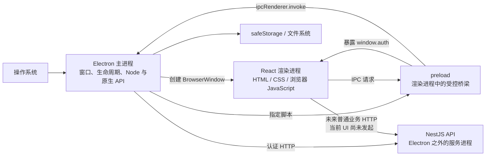

# 从官方概念到 Photo Lab 代码：Electron 入门与项目导读

> 阅读基线：2026-07-14；项目声明 [`electron: ^43.0.0`](../apps/desktop/package.json#L40-L41)，当前锁定 [Electron 43.1.0](../pnpm-lock.yaml#L2070)。本文面向第一次接触 Electron 的读者，官方概念均链接到 Electron 中文文档，项目实现均链接到当前代码行。

## 怎么阅读这篇文档

本文使用三种标记：

- **项目实现**：仓库里已经运行的代码。点击链接可直接跳到对应文件和行号。
- **补充 Demo**：项目暂未实现，但官方文档出现过的场景。代码只写在本文中，不要误认为已接入 Photo Lab。
- **官方原文**：跳转到 Electron 官方中文文档及对应章节。

行号链接对应当前代码快照；后续修改源码导致行号变化时，应同步更新本文。

官方阅读范围：

1. [简介](https://www.electronjs.org/zh/docs/latest/)
2. [为什么选择 Electron](https://www.electronjs.org/zh/docs/latest/why-electon)
3. [进程模型（官方中文页标题为“流程模型”）](https://www.electronjs.org/zh/docs/latest/tutorial/process-model)
4. [上下文隔离](https://www.electronjs.org/zh/docs/latest/tutorial/context-isolation)
5. [进程间通信](https://www.electronjs.org/zh/docs/latest/tutorial/ipc)
6. [进程沙盒化](https://www.electronjs.org/zh/docs/latest/tutorial/sandbox)
7. [Electron 中的消息端口](https://www.electronjs.org/zh/docs/latest/tutorial/message-ports)

“为什么选择 Electron”中文页当前官方路径确实是 `why-electon`（少一个 `r`），本文保留官方可访问地址。

扩展阅读：[BrowserWindow 中文 API](https://www.electronjs.org/zh/docs/latest/api/browser-window)、[安全清单](https://www.electronjs.org/zh/docs/latest/tutorial/security)。

阅读路线：

- [Electron 的选型背景](#why-electron)
- [进程地图](#process-map)
- [项目启动链路](#startup)
- [`BrowserWindow` 配置](#browser-window)
- [上下文隔离、preload 与沙盒](#isolation-preload-sandbox)
- [项目 IPC 主线](#ipc)
- [官方 IPC 示例](#ipc-official-examples)
- [MessagePort 全部示例](#message-port)
- [其余官方进程示例](#remaining-official-examples)
- [安全设计、调试与覆盖清单](#security)

几个会反复出现的词：

- **IPC（Inter-Process Communication，进程间通信）**：不同进程交换消息的机制。
- **CSP（Content Security Policy，内容安全策略）**：限制页面可以加载哪些脚本、图片和网络来源。
- **XSS（跨站脚本攻击）**：攻击者设法让恶意脚本在应用页面中执行。
- **Access Token**：短期访问 API 的凭据，本项目只放在 renderer 内存中。
- **Refresh Token**：用于换取新 Access Token 的长期凭据，本项目把它留在 main。
- **Electron Fiddle**：官方维护的最小示例实验工具，适合先验证一个独立 API。

## 先记住一句话

Electron 不是“网页外面套一个窗口”，而是：

> 用一个拥有 Node.js 和桌面权限的**主进程**管理应用，再让一个或多个受限制的**渲染进程**负责界面。在 Photo Lab 当前安全配置下，页面需要 Node/Electron 高权限能力时，要通过 **preload 暴露的窄接口**请求 main；普通 Web API 仍可直接在页面使用。

在 Photo Lab 中，这句话有一条真实的落地链路：

```text
React 登录页
  → window.auth.login(input)
  → preload 固定发送 auth.login
  → 主进程验证调用者和输入
  → 主进程请求后端并保存 Refresh Token
  → 只把 Access Token 和公开用户信息返回 React
```

理解这条链路，就理解了这个项目最重要的 Electron 部分。

---

<a id="why-electron"></a>

## 1. Electron 是什么，为什么会选它

[官方简介](https://www.electronjs.org/zh/docs/latest/)给出的核心组合是 **Chromium + Node.js + Electron 原生 API**：

- Chromium 负责 HTML、CSS、JavaScript 的渲染和 Web 平台能力；
- Node.js 让受信任的进程可以使用文件系统、网络、子进程等能力；
- Electron 把窗口、菜单、对话框、托盘、安全存储等桌面 API 接到这套运行时上；
- 同一套前端技术可面向 macOS、Windows 和 Linux。

这三个部分不是在所有代码里混用。Electron 的安全设计恰恰要求把它们分开：React 页面主要使用 Chromium；主进程使用 Node.js 和原生 API；preload 只桥接页面真正需要的能力。

### 1.1 为什么使用 Web 技术

[官方“为什么选择 Web 技术”](https://www.electronjs.org/zh/docs/latest/why-electon#为什么选择-web-技术)从四个角度说明它的价值：

- **多功能性**：HTML、CSS、JavaScript 可以构建高度定制的界面。官方列举了 Google Earth、Netflix、Spotify、Gmail、Facebook、Airbnb 和 GitHub。
- **可靠性**：Web 是广泛部署的 UI 技术栈，硬件、操作系统和浏览器长期围绕它优化。
- **互操作性**：很多服务已经提供 Web 集成方式；官方用嵌入 YouTube 播放器说明复用成熟方案的价值。
- **普遍性**：开发者、社区答案、工具和学习材料丰富。

官方还列举了 NASA 任务控制中心、彭博终端、麦当劳自助点餐机、SpaceX Dragon 2，以及 ATM、车载系统、智能电视、冰箱、Nintendo Switch 等运行 Web 界面的设备。这里想表达的不是“所有产品都应使用 Web”，而是 Web UI 已经经过非常广泛的现实检验。

### 1.2 为什么选择 Electron，而不是只嵌一个系统 WebView

[官方“为什么选择 Electron”](https://www.electronjs.org/zh/docs/latest/why-electon)强调（中文页当前这个同名小节的站内锚点有编码异常，因此链接到页面顶部）：

- 应用自己携带确定版本的 Chromium、V8 和 Node.js，不被用户机器上的旧 WebView 版本锁死；
- 开发者可以通过应用更新发布稳定性和安全修复；
- Node.js、npm、Electron 内置 API 和原生插件共同提供桌面能力；
- Electron 由多家公司和 OpenJS Foundation 生态共同维护。

官方专门解释了“为什么要把 Chromium 一起打包”：代价通常是约 80–100 MB 的应用体积和额外维护工作；收益是渲染器版本不再受最低操作系统版本限制，应用可以自己修复稳定性与安全问题。对于简单 HTML，系统 WebView 可能更省资源；对于大型应用，官方根据其项目经验认为较新的 Chromium 往往有更好的性能。这个判断是 Electron 维护者的工程经验，不是所有产品都成立的无条件定律。

官方列出的 Electron 应用包括 Slack、Discord、Signal、ChatGPT、Claude、VS Code、Loom、Canva、Notion 和 Docker。代价也很明确：二进制体积和内存开销通常高于很小的原生程序或系统 WebView。

在开发者能力方面，官方举出的例子还包括透明或异形窗口、Apple Push Notification service（APNs）、自定义 URL 协议，以及通过原生代码接入 SQLite、本地大语言模型或某个特定系统 API。这些能力不是自动出现在 React 中的，仍应由主进程或受隔离的后台进程承载。

成熟性同样是选型的一部分：Electron 主版本跟随 Chromium 的更新节奏，由多家公司参与去中心化维护，并作为 OpenJS Foundation 项目与 Node.js、ESLint、webpack 等生态共享经验。它能降低单一系统 WebView 长期不升级的风险，但应用团队仍要持续升级 Electron 并发布自己的客户端更新。

### 1.3 什么情况下不应选择 Electron

[官方选型边界](https://www.electronjs.org/zh/docs/latest/why-electon#为什么选择其他方案)同样重要：

- 极低内存、极低算力的嵌入式或物联网设备，例如约 1 MB 内存、100 MHz 主频的微控制器或智能手表；
- 对安装体积有严格限制；
- 产品主体必须由 WinUI、SwiftUI、AppKit 等系统控件构成；
- 高性能游戏或复杂实时 3D，更适合 Unity、Unreal、DirectX/OpenGL 等方案；
- 原生应用只需要嵌入一小块网页时，系统 WebView 或 Ultralight 一类轻量嵌入方案可能更合适。

对 Photo Lab 而言，Electron 的价值在于：现有 React 技术栈可以继续负责界面，同时图片文件、系统对话框、安全凭据和未来的本地处理能力可以留在受信任的桌面侧。

---

<a id="process-map"></a>

## 2. 先建立正确的进程地图

[官方进程模型](https://www.electronjs.org/zh/docs/latest/tutorial/process-model#为什么不是一个单一的进程)先解释了为什么不做成单进程：如果页面渲染、窗口管理和所有系统能力都挤在一个进程里，一个页面卡死或崩溃可能拖垮整个应用。Chromium 因而把页面工作拆到渲染进程，再由更高权限的浏览器进程统一管理；Electron 延续了这个模型。



### 2.1 四种角色

| 角色           | 数量与运行环境                                       | 应负责什么                             | Photo Lab 对应位置                                                  |
| -------------- | ---------------------------------------------------- | -------------------------------------- | ------------------------------------------------------------------- |
| 主进程         | 每个应用一个；Node.js 环境                           | 应用生命周期、窗口、原生能力、可信状态 | [`electron/main.ts`](../apps/desktop/electron/main.ts#L1-L88)       |
| 渲染进程       | 通常每个窗口一个；Chromium 页面环境                  | React UI、DOM、浏览器 API              | [`src/main.tsx`](../apps/desktop/src/main.tsx#L1-L40)               |
| preload        | **不是第三个操作系统进程**；在渲染进程中先于页面运行 | 把少量、明确的能力桥接给页面           | [`electron/preload.ts`](../apps/desktop/electron/preload.ts#L1-L18) |
| UtilityProcess | 按需创建；Node.js 子进程                             | CPU 密集、容易崩溃或需要隔离的后台任务 | 当前未使用，见[补充 Demo](#utility-process-demo)                    |

NestJS API、PostgreSQL 和仓库中的 [`apps/worker`](../apps/worker/src/main.ts#L1-L2) 是应用的外部服务，不属于 Electron 的主进程或渲染进程；其中 worker 当前仅有占位输出，尚未消费图片任务。

renderer 按普通 Web 页面规则工作：HTML 是入口、CSS 负责样式、浏览器 JavaScript/React 负责交互。默认情况下它不能使用 `require` 或 Node.js API；前端 npm 包要像普通网站一样由 Vite 等工具打包。

### 2.2 preload 最容易被误解

preload 有两个同时成立的特征：

1. 它运行在渲染进程中，并且早于页面脚本；
2. 它比普通页面拥有更多 Electron 能力，因此必须保持很小。

开启上下文隔离后，preload 和页面处在同一个渲染进程的不同 JavaScript 世界。它们可以看到同一份 DOM，但没有同一个全局 `window`。所以官方 quick-start 的 preload 可以修改 DOM，却不能靠 `window.myAPI = ...` 把任意对象直接塞给页面。

---

<a id="startup"></a>

## 3. Photo Lab 是怎样启动的

官方 quick-start 只有 `main.js`、`preload.js`、`index.html` 三个核心入口；Photo Lab 仍是这副骨架，只是多了 Electron Vite 构建和 React。第一次阅读时可以先看下面的真实启动链，再到 [9.1](#official-quick-start) 对照最小 Demo。

按照程序真实执行顺序阅读：

1. 根目录的 [`pnpm dev:desktop`](../package.json#L6-L9) 转到 desktop 包。
2. desktop 执行 [`electron-vite dev`](../apps/desktop/package.json#L6-L14)。构建后的 Electron 入口由 [`main: "out/main/main.js"`](../apps/desktop/package.json#L5-L8) 指定。
3. Electron Vite 分别编译[主进程入口](../apps/desktop/electron.vite.config.ts#L18-L26)、[preload 入口](../apps/desktop/electron.vite.config.ts#L27-L38)和[渲染器入口](../apps/desktop/electron.vite.config.ts#L39-L48)。
4. 主进程模块先[确定认证 API 地址](../apps/desktop/electron/main.ts#L7-L10)。
5. `app.whenReady()` 后，项目依次[创建 TokenStore、注册 IPC、创建窗口](../apps/desktop/electron/main.ts#L71-L75)。Electron 的窗口 API 不能在应用 ready 之前使用。
6. `createWindow()` 通过 [`new BrowserWindow(...)`](../apps/desktop/electron/main.ts#L17-L32) 创建原生窗口，同时绑定构建后的 preload。
7. preload 先运行，并[向页面暴露 `window.auth`](../apps/desktop/electron/preload.ts#L4-L18)。
8. 开发模式[加载 Vite 开发服务器 URL](../apps/desktop/electron/main.ts#L48-L50)，生产构建[加载本地 HTML](../apps/desktop/electron/main.ts#L50-L52)。
9. [`index.html` 加载 React 入口](../apps/desktop/index.html#L9-L12)，React 随后挂载应用。
10. `App` 首次挂载会[请求恢复登录会话](../apps/desktop/src/App.tsx#L9-L15)，因此启动后的第一条业务 IPC 通常是 `auth.refreshSession`。

### 3.1 开发模式与生产模式不是同一条加载路径

| 关注点        | 开发                                   | 生产构建 / 打包                                          |
| ------------- | -------------------------------------- | -------------------------------------------------------- |
| 页面来源      | `ELECTRON_RENDERER_URL`                | 本地 `renderer/index.html`                               |
| 加载方法      | `loadURL()`                            | `loadFile()`                                             |
| 热更新        | Vite WebSocket                         | 无                                                       |
| CSP           | 为开发工具临时放宽脚本与本地 WebSocket | 脚本只允许 `'self'`，网络放行 `'self'` 与配置的 API 来源 |
| Refresh Token | 只保存在内存                           | `app.isPackaged` 时尝试用 `safeStorage` 加密落盘         |

对应代码分别在[页面来源计算](../apps/desktop/electron/main.ts#L14-L16)与[实际加载分支](../apps/desktop/electron/main.ts#L48-L52)、[CSP 生成规则](../apps/desktop/electron.vite.config.ts#L62-L82)和[Token 持久化判断](../apps/desktop/electron/token-store.ts#L5-L10)。

注意：“加载生产构建产物”和 `app.isPackaged === true` 不是一回事。`electron-vite preview` 可以预览构建产物，但它仍可能不是已经打包、签名的最终应用。

---

<a id="browser-window"></a>

## 4. `new BrowserWindow()`：窗口也是一条安全边界

官方把主进程的首要职责概括为[创建和管理窗口](https://www.electronjs.org/zh/docs/latest/tutorial/process-model#窗口管理)。`BrowserWindow` 的每个实例对应一个原生窗口，并承载一个 `webContents`；页面通常运行在独立的渲染进程中。

Photo Lab 的完整构造代码在[这里](../apps/desktop/electron/main.ts#L17-L32)：

| 当前配置                          | 含义                        | 为什么这样配                                      |
| --------------------------------- | --------------------------- | ------------------------------------------------- |
| `width: 1180`、`height: 760`      | 初始窗口尺寸                | 给工作台留出合理空间                              |
| `minWidth: 960`、`minHeight: 640` | 最小缩放尺寸                | 避免布局被压到不可用                              |
| `title: 'Photo Lab'`              | 原生窗口初始标题            | 页面仍可按需要更新标题                            |
| `backgroundColor: '#f7f8fa'`      | 页面绘制前的底色            | 与 UI 接近，减少白屏闪烁                          |
| `show: false`                     | 创建后先隐藏                | 配合 `ready-to-show` 完成第一次绘制再展示         |
| `preload`                         | preload 的绝对路径          | 页面代码前安装受控桥梁                            |
| `contextIsolation: true`          | 隔离 preload 世界与页面世界 | 防止页面直接取得 preload 权限                     |
| `nodeIntegration: false`          | 页面不能直接用 Node.js      | 即使页面发生 XSS，也不能直接 `require('node:fs')` |
| `sandbox: true`                   | 启用 Chromium 沙盒          | 进一步限制渲染进程的系统访问                      |

`preload` 指向的是构建后的 `preload.cjs`，它的文件名和 CommonJS 输出由[Electron Vite 配置](../apps/desktop/electron.vite.config.ts#L27-L35)决定。

### 4.1 创建窗口之后还做了什么

- [等待 `ready-to-show` 再显示](../apps/desktop/electron/main.ts#L34-L36)，减少半成品页面闪现；
- [拦截跨到非可信来源的导航](../apps/desktop/electron/main.ts#L38-L43)；
- [拒绝所有 `window.open()` 新窗口](../apps/desktop/electron/main.ts#L45-L46)；
- [开发时 `loadURL`，生产时 `loadFile`](../apps/desktop/electron/main.ts#L48-L52)；
- [macOS 点击 Dock 且已无窗口时重建窗口](../apps/desktop/electron/main.ts#L77-L81)；
- [Windows/Linux 关闭全部窗口后退出，macOS 保持应用存活](../apps/desktop/electron/main.ts#L84-L88)。

这里的 `will-navigate` 和 `setWindowOpenHandler` 非常重要：`window.auth` 是有能力的接口。如果窗口被导航到攻击者控制的页面，而 preload 仍注入同一接口，那张外部页面也可能尝试调用认证能力。

### 4.2 常见但本项目没有显式设置的配置

[BrowserWindow 完整配置](https://www.electronjs.org/zh/docs/latest/api/browser-window#new-browserwindowoptions)很多，不应为了“配置齐全”全部复制。先理解这些常见项：

| 配置                                             | 何时考虑                | 安全提醒                                |
| ------------------------------------------------ | ----------------------- | --------------------------------------- |
| `resizable`、`maximizable`、`fullscreenable`     | 限制窗口交互            | 主要影响体验，不是安全开关              |
| `frame`、`titleBarStyle`、`trafficLightPosition` | 自定义标题栏            | 无边框窗口需要自己补拖拽、关闭等交互    |
| `parent`、`modal`                                | 设置父子窗口或模态窗口  | 子窗口同样要单独设置 preload 和安全选项 |
| `alwaysOnTop`                                    | 悬浮工具窗              | 谨慎使用，避免打扰用户                  |
| `webPreferences.devTools`                        | 是否允许打开 DevTools   | 关闭它不能代替真正的安全设计            |
| `webPreferences.partition`                       | 隔离 Cookie、缓存和会话 | 多账号或不可信内容可使用独立 session    |
| `webPreferences.webviewTag`                      | 是否允许 `<webview>`    | 默认关闭；开启后会扩大攻击面            |
| `webPreferences.webSecurity`                     | 同源策略等 Web 安全能力 | 保持默认 `true`，不要为绕过 CORS 而关闭 |

项目没有机械重复 `webSecurity: true`、`webviewTag: false` 等安全默认值。这是合理的；真正重要的是理解默认值，并在升级 Electron 时重新核对。

---

<a id="isolation-preload-sandbox"></a>

## 5. 上下文隔离、preload 与沙盒：三件不同的事

这三个开关经常被混为一谈：

| 设置                     | 它隔离什么                                      | 不能代替什么                  |
| ------------------------ | ----------------------------------------------- | ----------------------------- |
| `nodeIntegration: false` | 页面不能直接使用 Node.js                        | 不能代替上下文隔离            |
| `contextIsolation: true` | preload/Electron 内部世界与页面主世界的全局对象 | 不能自动保证暴露的 API 安全   |
| `sandbox: true`          | 限制渲染进程可接触的系统资源和完整 Node 环境    | 不能代替 IPC 输入与调用者校验 |

Electron 12 起默认启用上下文隔离，Electron 20 起默认沙盒化 renderer；Photo Lab 仍显式写出这两个选项，让安全意图在代码审查时一眼可见。主进程本身拥有 Node.js 和系统权限，不处在 renderer 的 Chromium 沙盒里；音频、GPU、网络等 Chromium 功能进程通常也由沙盒限制。

### 5.1 为什么 `window.myAPI = ...` 不再够用

[官方上下文隔离示例](https://www.electronjs.org/zh/docs/latest/tutorial/context-isolation#迁移)对比了旧写法和新写法。

隔离关闭时，旧项目可能在 preload 里这样写：

```js
// 历史写法：不要用于本项目
window.myAPI = { doAThing: () => {} };
```

隔离开启后，preload 世界里的 `window` 不是页面世界里的 `window`，页面读取会得到 `undefined`。正确方式是 `contextBridge`：

```ts
contextBridge.exposeInMainWorld('myAPI', {
  doAThing: () => {
    // 只执行允许页面做的这一件事
  },
});
```

两种方案的 renderer 调用形式相同：

```ts
// renderer.ts
window.myAPI.doAThing();
```

区别在 API 如何到达页面：隔离关闭时，旧 preload 直接改共享的 `window`；隔离开启后若仍直接赋值，renderer 看到的是 `undefined`，只有经 `contextBridge` 暴露后，上面的调用才成立。

Photo Lab 已经使用正确方式：[preload 创建四个具体方法](../apps/desktop/electron/preload.ts#L4-L15)，再通过 [`exposeInMainWorld('auth', authApi)`](../apps/desktop/electron/preload.ts#L17-L18)暴露给 React。

### 5.2 `contextBridge` 不是“开了就安全”

[官方安全反例](https://www.electronjs.org/zh/docs/latest/tutorial/context-isolation#安全事项)是把原始 `ipcRenderer.send` 整体暴露出去：

```ts
// ❌ 页面可以自己选任意 channel 和任意参数
contextBridge.exposeInMainWorld('electronAPI', {
  send: ipcRenderer.send,
});
```

更安全的接口应表达业务能力，并把 channel 固定在 preload 内部：

```ts
// ✅ 页面只能请求“读取偏好”，不能发送任意 IPC
contextBridge.exposeInMainWorld('electronAPI', {
  loadPreferences: () => ipcRenderer.invoke('preferences:load'),
});
```

Photo Lab 的 `window.auth.login()`、`register()`、`refreshSession()`、`logoutSession()`正是这个原则的真实版本。页面既拿不到 `ipcRenderer`，也不能自行构造第五种认证 channel。

`contextBridge` 也有数据边界：自定义原型和 `Symbol` 不能直接跨桥传递。优先暴露由普通数据和函数组成的小接口，不要把复杂类实例当成“共享对象”。

### 5.3 TypeScript 类型只解决开发体验，不解决运行时安全

官方的[TypeScript 示例](https://www.electronjs.org/zh/docs/latest/tutorial/context-isolation#与typescript一同使用)分三步：preload 暴露接口、声明全局 `Window` 类型、renderer 正常调用。

项目对应实现是：

- [统一定义 `DesktopAuthApi`](../apps/desktop/electron/ipc/auth.channels.ts#L32-L37)；
- [扩展 `Window.auth`](../apps/desktop/src/vite-env.d.ts#L3-L8)；
- React 因而能获得 `window.auth.login()` 的参数和返回值类型。

但 TypeScript 编译后会消失。低权限渲染进程发到主进程的值仍必须按“不可信输入”处理，所以项目又用 [Zod 校验登录与注册输入](../apps/desktop/electron/auth/auth-input-schemas.ts#L4-L12)。

### 5.4 沙盒化 preload 并不是完整 Node.js 环境

[官方沙盒说明](https://www.electronjs.org/zh/docs/latest/tutorial/sandbox#preload-脚本)指出，沙盒化 preload 只能加载有限的 Electron/Node 模块和全局对象，例如 `contextBridge`、`ipcRenderer`、`events`、`timers`、`url`、`Buffer` 和受限的 `process`。它不能被理解为“可以随意使用所有 Node API”。

Photo Lab 的 preload 只导入 `contextBridge`、`ipcRenderer` 和一份本地类型/常量文件。Electron Vite 会把 preload 代码打成单个 CJS 入口，这与沙盒约束相匹配。

### 5.5 官方沙盒配置示例，一个也不要混淆

以下均是**补充 Demo（项目没有采用）**，先看官方的[单进程沙盒配置](https://www.electronjs.org/zh/docs/latest/tutorial/sandbox#为单个进程禁用沙盒)：

```ts
// ⚠️ 只关闭某个窗口的沙盒；除非有明确兼容性原因，否则不要这样做
const unsafeWindow = new BrowserWindow({
  webPreferences: { sandbox: false },
});

// ⚠️ 开启 Node 集成也会让该渲染器失去沙盒保护
const nodeWindow = new BrowserWindow({
  webPreferences: { nodeIntegration: true },
});
```

官方也展示了下面这个危险写法。它会给 webview 内容 Node 能力；Photo Lab 既没有启用 `webviewTag`，也不应加入：

```html
<!-- ⚠️ 机制示例，不要加入 Photo Lab -->
<webview nodeIntegration src="page.html"></webview>
```

如果要[强制所有渲染器使用沙盒](https://www.electronjs.org/zh/docs/latest/tutorial/sandbox#全局启用沙盒)，可在 ready 之前调用：

```ts
// 补充 Demo：项目当前选择在每个 BrowserWindow 上显式写 sandbox: true
app.enableSandbox();

void app.whenReady().then(() => {
  const win = new BrowserWindow();
  void win.loadFile('index.html');
});
```

[官方 `--no-sandbox` 示例](https://www.electronjs.org/zh/docs/latest/tutorial/sandbox#禁用-chromium-的沙盒仅测试)会关闭 Chromium 所有进程的系统沙盒：

```sh
# ⚠️ 只用于隔离的测试诊断，绝不能用于生产
electron --no-sandbox .
```

即使某个窗口同时写了 `sandbox: true`，它也只是失去 renderer 的 Node 环境，不能把已经被命令行关闭的 Chromium 系统沙盒重新打开。

沙盒的核心不是“让页面什么都做不了”，而是让页面把文件系统、系统修改、子进程等高权限任务委托给主进程，并由主进程决定是否执行。

### 5.6 沙盒也不等于“可以放心加载任意网站”

[官方“不可信内容”章节](https://www.electronjs.org/zh/docs/latest/tutorial/sandbox#渲染不可信内容的注意事项)给出四个现实限制：Electron 项目的专职安全资源少于 Chromium；它没有完整继承依赖中心化服务的 Safe Browsing、证书透明度等能力；成千上万种应用配置会产生不同攻击面；Electron 也不能绕过应用供应商直接给最终用户推送安全修复。

因此应持续升级到最新稳定版 Electron，并由应用团队及时发布更新。沙盒是纵深防御的一层，不是加载不可信远程内容的免责卡。

---

<a id="ipc"></a>

## 6. IPC：进程之间怎样说话

[IPC 官方指南](https://www.electronjs.org/zh/docs/latest/tutorial/ipc)把通信分成四种方向。先看选择表：

| 需求                            | 推荐组合                                | 返回值     | Photo Lab 是否使用 |
| ------------------------------- | --------------------------------------- | ---------- | ------------------ |
| renderer 通知 main，不等结果    | `ipcRenderer.send` + `ipcMain.on`       | 无         | 否                 |
| renderer 请求 main 并等待结果   | `ipcRenderer.invoke` + `ipcMain.handle` | Promise    | **是**             |
| main 主动推送 renderer          | `webContents.send` + `ipcRenderer.on`   | 默认无     | 否                 |
| renderer 与另一个 renderer 通信 | main 转发，或 `MessagePort` 直连        | 视设计而定 | 否                 |
| 连续数据、双向长连接            | `MessagePort`                           | 多次消息   | 否                 |

IPC 的 channel 只是开发者命名的字符串，不会自动形成权限，也没有固定方向。`auth.`、官方例子中的 `dialog:` 等前缀只是便于阅读的命名空间，没有额外语义。项目将四个 channel [集中定义为常量](../apps/desktop/electron/ipc/auth.channels.ts#L24-L30)，避免 main 与 preload 因拼写不同而静默失联。

### 6.1 Photo Lab 的完整登录调用链

1. 用户提交表单后，[`LoginPage` 调用 `window.auth.login(values)`](../apps/desktop/src/pages/LoginPage.tsx#L15-L19)。
2. preload 把它变成 [`ipcRenderer.invoke(authIpcChannels.login, input)`](../apps/desktop/electron/preload.ts#L4-L8)。
3. 主进程通过 [`ipcMain.handle(authIpcChannels.login, ...)`](../apps/desktop/electron/ipc/auth.ipc.ts#L25-L32)接收。
4. handler 先[验证消息来自可信主 frame](../apps/desktop/electron/ipc/auth.ipc.ts#L93-L105)，再用 Zod 校验输入。
5. 登录 handler [把 `/auth/login` 交给 `createSession`](../apps/desktop/electron/ipc/auth.ipc.ts#L25-L31)，后者[调用 `postJson`](../apps/desktop/electron/ipc/auth.ipc.ts#L53-L60)，最终由[主进程中的 `fetch`](../apps/desktop/electron/auth/auth-api-client.ts#L15-L40)发出请求。认证 HTTP 因而不从 React 直接发出。
6. 协调器[保存 Refresh Token](../apps/desktop/electron/auth/auth-session-coordinator.ts#L19-L25)。打包应用会尝试用 [`safeStorage` 加密后写盘](../apps/desktop/electron/token-store.ts#L12-L35)。
7. 主进程[有意删除 Refresh Token](../apps/desktop/electron/ipc/auth.ipc.ts#L62-L67)，只让结构化克隆把 Access Token 和用户信息送回 renderer。
8. React [把安全缩减后的会话写入内存状态](../apps/desktop/src/pages/LoginPage.tsx#L27-L34)。

这条链路同时展示了进程分工、preload、上下文隔离、请求—响应 IPC、运行时校验和最小权限原则。

### 6.2 四个认证 channel

| Channel               | renderer 触发点                                                                                                                                                                         | preload                                                    | main handler                                                     |
| --------------------- | --------------------------------------------------------------------------------------------------------------------------------------------------------------------------------------- | ---------------------------------------------------------- | ---------------------------------------------------------------- |
| `auth.login`          | [登录页](../apps/desktop/src/pages/LoginPage.tsx#L15-L19)                                                                                                                               | [第 6–7 行](../apps/desktop/electron/preload.ts#L6-L7)     | [登录 handler](../apps/desktop/electron/ipc/auth.ipc.ts#L25-L32) |
| `auth.register`       | [注册页](../apps/desktop/src/pages/RegisterPage.tsx#L16-L26)                                                                                                                            | [第 9–10 行](../apps/desktop/electron/preload.ts#L9-L10)   | [注册 handler](../apps/desktop/electron/ipc/auth.ipc.ts#L34-L40) |
| `auth.refreshSession` | [启动恢复](../apps/desktop/src/stores/auth.store.ts#L32-L60)、[检测 401 并刷新重试](../apps/desktop/src/api/http.ts#L55-L100)、[刷新 helper](../apps/desktop/src/api/http.ts#L117-L136) | [第 11–14 行](../apps/desktop/electron/preload.ts#L11-L14) | [刷新 handler](../apps/desktop/electron/ipc/auth.ipc.ts#L42-L45) |
| `auth.logoutSession`  | [退出清理](../apps/desktop/src/api/session.ts#L12-L23)                                                                                                                                  | [第 8 行](../apps/desktop/electron/preload.ts#L8)          | [退出 handler](../apps/desktop/electron/ipc/auth.ipc.ts#L47-L50) |

### 6.3 IPC 边界上的四道防线

项目并不因为“页面是自己写的”就无条件信任它：

1. `event.senderFrame` 必须存在；
2. 它必须是当前 `webContents` 的主 frame，子 frame 不能调用认证 IPC；
3. 开发时 URL 必须与 Vite server 同源，生产时必须是准确的本地入口文件；
4. 输入和后端响应都执行运行时结构校验。

对应实现是[调用方检查](../apps/desktop/electron/ipc/auth.ipc.ts#L93-L105)、[可信 URL 判断](../apps/desktop/electron/auth/trusted-renderer.ts#L1-L20)、[输入 schema](../apps/desktop/electron/auth/auth-input-schemas.ts#L4-L12)和[响应 schema](../apps/desktop/electron/ipc/auth.ipc.ts#L107-L123)。

渲染进程仍可持有短期 Access Token，因此 XSS 依然有危害。把 Refresh Token 留在主进程是缩小影响范围，不是放松 CSP 和输入输出编码的理由。

---

<a id="ipc-official-examples"></a>

## 7. 官方 IPC 示例逐个对照

官方 IPC 页的三个完整 Fiddle 都包含 `main.js`、`preload.js`、`index.html`、`renderer.js`，以及 macOS `activate`、`window-all-closed` 等生命周期代码：

- [Pattern 1：单向修改窗口标题](https://github.com/electron/electron/tree/v41.5.0/docs/fiddles/ipc/pattern-1)
- [Pattern 2：请求打开文件对话框](https://github.com/electron/electron/tree/v41.5.0/docs/fiddles/ipc/pattern-2)
- [Pattern 3：原生菜单控制页面计数器](https://github.com/electron/electron/tree/v41.5.0/docs/fiddles/ipc/pattern-3)

官方页面当前把这些 Fiddle 标为 Electron 41.5.0，而项目锁定 43.1.0；本文涉及的基本 IPC API 仍适用，但实际接入时应以项目版本 API 为准重新验证。下面保留每个例子的通信本质，并用 TypeScript 和更窄的桥接接口重写。它们都是**补充 Demo，未接入 Photo Lab**。

为避免每个例子重复启动样板，下面展示的是 main、preload、renderer 的**核心片段**，省略了无关 imports、`Window` 类型声明和窗口生命周期，不能整段单独复制运行。所有 renderer → main 入口都要执行与项目相同的[主 frame 与来源检查](../apps/desktop/electron/ipc/auth.ipc.ts#L93-L105)，但错误方式要区分：`invoke/handle` 可以用 `assertTrustedSender(event)` 抛错并让 Promise 失败；`send/on` 没有 Promise 接住异常，应使用不抛错的布尔 guard `if (!isTrustedSender(event)) return`。两者检查规则相同，接入真实功能时都不能省略。

### 7.1 模式 1：renderer → main，单向通知

[官方例子](https://www.electronjs.org/zh/docs/latest/tutorial/ipc#模式-1渲染器进程到主进程单向)让用户输入标题，然后由主进程修改当前 `BrowserWindow` 标题。发送方不需要结果，所以使用 `send/on`。

```ts
// main.ts
import { BrowserWindow, ipcMain } from 'electron';

ipcMain.on('window:set-title', (event, value: unknown) => {
  if (!isTrustedSender(event)) return;
  if (typeof value !== 'string') return;

  const win = BrowserWindow.fromWebContents(event.sender);
  win?.setTitle(value.slice(0, 80));
});
```

```ts
// preload.ts
contextBridge.exposeInMainWorld('windowControls', {
  setTitle: (title: string) => ipcRenderer.send('window:set-title', title),
});
```

```html
<!-- index.html -->
<input id="title" />
<button id="set-title" type="button">设置标题</button>
```

```ts
// renderer.ts
document.querySelector('#set-title')?.addEventListener('click', () => {
  const input = document.querySelector<HTMLInputElement>('#title');
  window.windowControls.setTitle(input?.value ?? '');
});
```

核心不是 `setTitle`，而是三段式边界：renderer 调业务方法、preload 固定 channel、main 执行高权限动作。不要暴露通用的 `send(channel, ...args)`。

### 7.2 模式 2：renderer → main，请求并等待响应

[官方例子](https://www.electronjs.org/zh/docs/latest/tutorial/ipc#模式-2渲染器进程到主进程双向)从页面打开系统文件选择框，并把文件路径返回页面。这正是 Photo Lab 认证 IPC 已使用的 `invoke/handle` 模式，只是项目当前没有文件对话框。

```ts
// main.ts
import { dialog, ipcMain } from 'electron';

ipcMain.handle('dialog:pick-image', async (event) => {
  assertTrustedSender(event);
  const result = await dialog.showOpenDialog({
    filters: [{ name: 'Images', extensions: ['jpg', 'jpeg', 'png', 'webp'] }],
    properties: ['openFile'],
  });

  return result.canceled || result.filePaths.length === 0 ? null : result.filePaths[0];
});
```

```ts
// preload.ts
contextBridge.exposeInMainWorld('files', {
  pickImage: () => ipcRenderer.invoke('dialog:pick-image') as Promise<string | null>,
});
```

```ts
// renderer.ts
const selectedPath = await window.files.pickImage();
if (selectedPath) console.log('用户选择：', selectedPath);
```

`ipcMain.handle` 抛出的错误要经过跨进程序列化，renderer 通常只能可靠获得消息文本，不能假定自定义 Error 子类和全部字段都会保留。项目已在[错误消息归一化](../apps/desktop/src/api/http.ts#L29-L53)中处理了 Electron 添加的调用前缀。官方关联说明见 [electron/electron#24427](https://github.com/electron/electron/issues/24427)。

### 7.3 旧式异步双向：`send` + `event.reply`

[官方保留这个例子](https://www.electronjs.org/zh/docs/latest/tutorial/ipc#使用-ipcrenderersend)是为了说明历史代码，不是推荐新项目照抄：

```ts
// main.ts
ipcMain.on('legacy:ping', (event, value) => {
  if (!isTrustedSender(event)) return;
  if (typeof value !== 'string') return;
  event.reply('legacy:pong', { echoed: value });
});

// preload.ts
ipcRenderer.once('legacy:pong', (_event, result) => console.log(result));
ipcRenderer.send('legacy:ping', 'hello');
```

它需要请求、响应两个 channel；并发请求多时还要自己设计 request ID，把每个响应配回原请求。新代码直接使用 `invoke/handle`。

### 7.4 同步双向：`sendSync`

[官方同步例子](https://www.electronjs.org/zh/docs/latest/tutorial/ipc#使用-ipcrenderersendsync)通过 `event.returnValue` 返回 `pong`：

```ts
// main.ts
ipcMain.on('legacy:ping-sync', (event) => {
  if (!isTrustedSender(event)) return;
  event.returnValue = 'pong';
});

// preload.ts —— ⚠️ 不要用于耗时工作
const result = ipcRenderer.sendSync('legacy:ping-sync');
```

它会阻塞渲染进程；主进程稍慢，整个窗口就失去响应。Photo Lab 的网络认证绝不能使用这种模式。

### 7.5 模式 3：main → renderer，主动推送

[官方例子](https://www.electronjs.org/zh/docs/latest/tutorial/ipc#模式-3主进程到渲染器进程)创建原生菜单，点击加减项后用 `webContents.send('update-counter', value)` 更新页面计数器。主进程发送时必须明确目标 `webContents`。

下面把同一模式改写成“菜单改变图片缩放”：

```ts
// main.ts
import { Menu } from 'electron';

const menu = Menu.buildFromTemplate([
  {
    label: '视图',
    submenu: [
      { label: '放大', click: () => mainWindow.webContents.send('image:zoom', 0.1) },
      { label: '缩小', click: () => mainWindow.webContents.send('image:zoom', -0.1) },
    ],
  },
]);
Menu.setApplicationMenu(menu);
```

```ts
// preload.ts
contextBridge.exposeInMainWorld('imageView', {
  onZoom: (callback: (delta: number) => void) => {
    const listener = (_event: Electron.IpcRendererEvent, value: unknown) => {
      if (typeof value === 'number') callback(value);
    };

    ipcRenderer.on('image:zoom', listener);
    return () => {
      ipcRenderer.removeListener('image:zoom', listener);
    };
  },
  reportZoom: (value: unknown) => {
    if (typeof value === 'number' && Number.isFinite(value)) {
      ipcRenderer.send('image:zoom-value', value);
    }
  },
});
```

```ts
// renderer.ts
let currentZoom = 1;
const unsubscribe = window.imageView.onZoom((delta) => {
  currentZoom = Math.max(0.1, currentZoom + delta);
  window.imageView.reportZoom(currentZoom);
});

// 页面离开或 React 组件卸载时再调用，避免重复注册
window.addEventListener('beforeunload', unsubscribe, { once: true });
```

preload 故意丢弃原始 Electron `event`，只把经过检查的 `number` 交给页面。直接把 `callback` 传给 `ipcRenderer.on` 会把高权限事件对象一起泄露。返回取消订阅函数还能避免 React 重复挂载造成监听器累积。

[官方同一小节的备选写法](https://www.electronjs.org/zh/docs/latest/tutorial/ipc#2-通过预加载脚本暴露-ipcrendereron)没有使用 `contextBridge`，而是让 preload 在 DOM 就绪后直接更新页面元素。沿用缩放场景，页面先提供 `<strong id="zoom-value">1.0</strong>`，preload 的核心片段是：

```ts
// preload.ts —— 与上面的桥接方案二选一
window.addEventListener('DOMContentLoaded', () => {
  const output = document.querySelector('#zoom-value');

  ipcRenderer.on('image:zoom', (_event, value: unknown) => {
    if (!output || typeof value !== 'number' || !Number.isFinite(value)) return;

    const current = Number(output.textContent ?? '1');
    if (!Number.isFinite(current)) return;
    output.textContent = Math.max(0.1, current + value).toFixed(1);
  });
});
```

它能成立，是因为上下文隔离分开全局对象但不分开 DOM；代价是监听器被写死在 preload 里，无法方便地参与 React 状态和组件生命周期。Photo Lab 这类 React 应用更适合前一个“窄桥接 + renderer 更新 UI”的方案。

### 7.6 main 发起后，renderer 再回复

主进程到 renderer 没有与 `invoke` 完全对称的 API。[官方可选回复例子](https://www.electronjs.org/zh/docs/latest/tutorial/ipc#可选返回一个回复)让 renderer 通过第二个 channel 报告新计数值。上一个 Demo 已在收到 `image:zoom` 后调用 `reportZoom(currentZoom)`，main 再接住回复：

```ts
// main.ts
ipcMain.on('image:zoom-value', (event, value: unknown) => {
  if (!isTrustedSender(event)) return;
  if (typeof value === 'number' && Number.isFinite(value)) console.log('当前缩放：', value);
});
```

如果流程本质上是 renderer 请求 main 并等待一个结果，应回到 `invoke/handle`，不要人为拼两条 channel。

### 7.7 模式 4：renderer → renderer

[官方说明](https://www.electronjs.org/zh/docs/latest/tutorial/ipc#模式-4渲染器进程到渲染器进程)指出，`ipcMain/ipcRenderer` 没有直接的 renderer-to-renderer 发送方法，有两种设计：

1. **主进程中转**：A `send` 给 main，main 再 `webContents.send` 给 B；结构简单，适合低频控制消息。
2. **MessagePort 直连**：main 只负责给 A、B 各发一个端口，之后数据不再经过 main；适合频繁或持续通信。

主进程中转的核心代码如下：

```ts
// 补充 Demo：targetWindow 由主进程持有
ipcMain.on('preview:update', (event, payload: unknown) => {
  if (!isTrustedSender(event)) return;
  if (typeof payload !== 'object' || payload === null) return;

  const data = payload as { imageId?: unknown };
  if (typeof data.imageId !== 'string' || data.imageId.length > 128) return;

  targetWindow.webContents.send('preview:update', { imageId: data.imageId });
});
```

MessagePort 版本见下一章。

### 7.8 IPC 能传什么：结构化克隆

[官方对象序列化说明](https://www.electronjs.org/zh/docs/latest/tutorial/ipc#对象序列化)指出，Electron IPC 使用结构化克隆算法。字符串、数字、数组、普通对象等可以传；下列对象不能直接传：

- DOM 的 `Element`、`Location` 等；
- `process.env`、部分 Stream；
- `BrowserWindow`、`WebContents`、`WebFrame` 等由 C++ 支撑的 Electron 对象。

Photo Lab 的 [`DesktopAuthSession`](../apps/desktop/electron/ipc/auth.channels.ts#L9-L13)只含字符串和普通用户对象，天然适合跨进程。正确做法是传递数据，而不是试图把主进程对象本身交给 React。

---

<a id="message-port"></a>

## 8. MessagePort：从“一次调用”升级为“一条通道”

> 本章是进阶内容。第一次阅读只需记住“登录等一次请求用 `invoke/handle`”；理解完 main、renderer、preload 和普通 IPC 后再回来读 Port。

`invoke/handle` 像一次函数调用：发一个请求，等一个结果。`MessagePort` 更像建立一条专用线路：两端可以持续互发多条消息。

本章继续沿用上一章的片段约定：凡是 renderer 通过 `send/postMessage` 发到 main 的初始建链消息，`ipcMain.on` listener 都先用不抛错的 `isTrustedSender(event)` guard；Port 建好以后，每一端还要继续校验通道中的业务消息。

[官方消息端口文档](https://www.electronjs.org/zh/docs/latest/tutorial/message-ports)中的关键概念是：

- `MessageChannel` 总是成对产生 `port1` 和 `port2`；发给一端的消息由另一端收到；
- 接收方尚未注册监听器时，消息会排队；
- renderer 使用 Web 风格 `MessagePort`，main 使用 Electron 提供的 `MessagePortMain`；
- main 使用 Node 风格的 `port.on('message', ...)`，并需要调用 `port.start()`；
- 普通 `send` 和 `invoke` **不能转移端口**，要用 `ipcRenderer.postMessage`、`webContents.postMessage` 或 `senderFrame.postMessage`；
- Port 是可转移对象。转移后原发送方不再拥有同一端口；
- Electron 还扩展了 `close` 事件，对端显式关闭或被垃圾回收时会触发。

什么时候值得用它：高频消息、持续进度、流式结果、两个 renderer 直连。一次登录请求用 `invoke` 更清楚，不应为了“高级”改成 MessagePort。

### 8.1 官方基础例子：renderer 把一个 Port 交给 main

这是**补充 Demo（项目未实现）**，对应[官方页面开头的基础示例](https://www.electronjs.org/zh/docs/latest/tutorial/message-ports)：

```ts
// preload.ts（位于 renderer 进程的隔离世界）
const channel = new MessageChannel();

// 可以先发送；main 调用 start() 后再消费排队消息
channel.port2.postMessage({ answer: 42 });

// 把 port1 的所有权转移给 main
ipcRenderer.postMessage('demo:port', null, [channel.port1]);
```

```ts
// main.ts
ipcMain.on('demo:port', (event) => {
  if (!isTrustedSender(event)) return;
  const [port] = event.ports;
  if (!port) return;

  port.on('message', (messageEvent) => {
    const data = messageEvent.data;
    if (
      typeof data === 'object' &&
      data !== null &&
      'answer' in data &&
      typeof data.answer === 'number'
    ) {
      console.log(data); // { answer: 42 }
    }
  });
  port.start();
});
```

这里的 `event.ports[0]` 到了主进程后就是 `MessagePortMain`。

### 8.2 官方例子一：连接两个渲染进程

[官方双 renderer 示例](https://www.electronjs.org/zh/docs/latest/tutorial/message-ports#在两个渲染进程之间建立-messagechannel)由 main 创建通道，把两端分别交给两个窗口。main 只负责建链，后续消息直接在两个 renderer 之间流动。

官方代码为了缩短篇幅使用了 `contextIsolation: false`，并把 Port 直接挂到 `window`。下面是更适合生产思路的改写：

```ts
// main.ts
import { join } from 'node:path';
import { app, BrowserWindow, MessageChannelMain } from 'electron';

const firstPreloadPath = join(__dirname, 'first-preload.cjs');
const secondPreloadPath = join(__dirname, 'second-preload.cjs');

void app.whenReady().then(async () => {
  const firstWindow = new BrowserWindow({
    webPreferences: {
      contextIsolation: true,
      nodeIntegration: false,
      sandbox: true,
      preload: firstPreloadPath,
    },
  });
  const secondWindow = new BrowserWindow({
    webPreferences: {
      contextIsolation: true,
      nodeIntegration: false,
      sandbox: true,
      preload: secondPreloadPath,
    },
  });

  await Promise.all([firstWindow.loadFile('first.html'), secondWindow.loadFile('second.html')]);

  const { port1, port2 } = new MessageChannelMain();
  firstWindow.webContents.postMessage('peer:port', null, [port1]);
  secondWindow.webContents.postMessage('peer:port', null, [port2]);
});
```

两个窗口的 preload 可使用同一套窄接口：

```ts
// preload.ts
let peerPort: MessagePort | undefined;
const listeners = new Set<(message: string) => void>();
const pendingMessages: string[] = [];

ipcRenderer.on('peer:port', (event) => {
  peerPort = event.ports[0];
  if (!peerPort) return;

  peerPort.onmessage = (messageEvent) => {
    if (typeof messageEvent.data !== 'string') return;
    for (const listener of listeners) listener(messageEvent.data);
  };
  peerPort.start();
  for (const message of pendingMessages.splice(0)) peerPort.postMessage(message);
});

contextBridge.exposeInMainWorld('peer', {
  send: (message: unknown) => {
    if (typeof message !== 'string' || message.length > 1000) return;
    if (peerPort) peerPort.postMessage(message);
    else if (pendingMessages.length < 100) pendingMessages.push(message);
  },
  onMessage: (listener: (message: string) => void) => {
    listeners.add(listener);
    return () => {
      listeners.delete(listener);
    };
  },
});
```

```ts
// 任一窗口的 renderer.ts
const stopListening = window.peer.onMessage((message) => console.log('另一个窗口：', message));
window.peer.send('ping');

// 页面或组件销毁时调用
window.addEventListener('beforeunload', stopListening, { once: true });
```

即使通道已经直连，也要校验消息结构、限制暴露的方法，并在窗口销毁时释放资源。

### 8.3 官方例子二：隐藏的 Worker 窗口

[官方 Worker 示例](https://www.electronjs.org/zh/docs/latest/tutorial/message-ports#worker进程)用一个隐藏的 `BrowserWindow` 承载 Blink 环境，因此它可以使用 canvas、音频、`fetch()` 等 Web 能力。主窗口请求通道，main 把一端给 Worker、另一端给主窗口，此后两者直接通信。

官方通过 `mainWindow.webContents.mainFrame.ipc.on(...)` 监听顶层 frame 请求；这里不能用 `ipcMain.handle` 直接回复，因为响应需要转移 Port。官方示例还使用了 `nodeIntegration: true`，会关闭沙盒，只适合解释机制。下面用 `ipcMain.on` 保留同一流程，但窗口仍使用安全配置：

```ts
// main.ts
import { join } from 'node:path';
import { app, BrowserWindow, ipcMain, MessageChannelMain } from 'electron';

const workerPreloadPath = join(__dirname, 'worker-preload.cjs');

void app.whenReady().then(async () => {
  const workerWindow = new BrowserWindow({
    show: false,
    webPreferences: {
      contextIsolation: true,
      nodeIntegration: false,
      sandbox: true,
      preload: workerPreloadPath,
    },
  });
  await workerWindow.loadFile('worker.html');

  ipcMain.on('worker:connect', (event, requestId: unknown) => {
    if (!isTrustedSender(event)) return;
    if (typeof requestId !== 'string') return;

    const { port1, port2 } = new MessageChannelMain();
    workerWindow.webContents.postMessage('worker:client', null, [port1]);
    event.sender.mainFrame.postMessage('worker:port', { requestId }, [port2]);
  });
});
```

```ts
// worker-preload.ts
ipcRenderer.on('worker:client', (event) => {
  const [port] = event.ports;
  if (!port) return;

  port.onmessage = ({ data }) => {
    if (typeof data === 'number' && Number.isFinite(data)) port.postMessage(data * 2);
  };
  port.start();
});
```

```ts
// app-preload.ts
contextBridge.exposeInMainWorld('worker', {
  double: (value: unknown) => {
    if (typeof value !== 'number' || !Number.isFinite(value)) {
      return Promise.reject(new TypeError('Worker input must be a finite number.'));
    }

    return new Promise<number>((resolve, reject) => {
      const requestId = crypto.randomUUID();
      const listener = (event: Electron.IpcRendererEvent, payload: unknown) => {
        if (
          typeof payload !== 'object' ||
          payload === null ||
          !('requestId' in payload) ||
          payload.requestId !== requestId
        ) {
          return;
        }

        ipcRenderer.removeListener('worker:port', listener);
        const [port] = event.ports;
        if (!port) return reject(new Error('Worker port is unavailable.'));

        port.onmessage = ({ data }) => {
          port.close();
          if (typeof data === 'number' && Number.isFinite(data)) resolve(data);
          else reject(new TypeError('Worker returned an invalid result.'));
        };
        port.start();
        port.postMessage(value);
      };

      ipcRenderer.on('worker:port', listener);
      ipcRenderer.send('worker:connect', requestId);
    });
  },
});
```

```ts
// renderer.ts
const result = await window.worker.double(21);
console.log(result); // 42
```

为突出建链，上例省略了超时、Port `close`、Worker 崩溃和窗口销毁处理；生产实现必须让这些路径 reject 并移除 listener，不能留下永久 pending 的 Promise。如果后台任务只需要 Node.js 和 CPU，不需要 DOM/canvas/音频等 Blink 能力，应优先考虑 `UtilityProcess`，而不是用隐藏窗口模拟 Worker。

### 8.4 官方例子三：一次请求返回一串结果

[官方“回复流”示例](https://www.electronjs.org/zh/docs/latest/tutorial/message-ports#回复流)为每次请求创建一对轻量 Port：renderer 留一端，把另一端交给 main；main 连续发送多条数据，最后 `close()` 表示结束。

```ts
// preload.ts
contextBridge.exposeInMainWorld('streamDemo', {
  repeat: (value: unknown, count: unknown, onValue: unknown) => {
    if (
      typeof value !== 'number' ||
      !Number.isFinite(value) ||
      typeof count !== 'number' ||
      !Number.isInteger(count) ||
      count < 0 ||
      count > 100 ||
      typeof onValue !== 'function'
    ) {
      return Promise.reject(new TypeError('Invalid stream request.'));
    }

    return new Promise<void>((resolve) => {
      const { port1, port2 } = new MessageChannel();

      port1.onmessage = (event) => {
        if (typeof event.data === 'number' && Number.isFinite(event.data)) onValue(event.data);
      };
      port1.addEventListener('close', () => resolve(), { once: true });
      port1.start();

      ipcRenderer.postMessage('stream:repeat', { value, count }, [port2]);
    });
  },
});
```

```ts
// main.ts
ipcMain.on('stream:repeat', (event, input: unknown) => {
  if (!isTrustedSender(event)) return;
  const [replyPort] = event.ports;
  if (!replyPort) return;

  if (typeof input !== 'object' || input === null) {
    replyPort.close();
    return;
  }

  const data = input as { count?: unknown; value?: unknown };
  if (
    typeof data.value !== 'number' ||
    !Number.isFinite(data.value) ||
    typeof data.count !== 'number' ||
    !Number.isInteger(data.count) ||
    data.count < 0 ||
    data.count > 100
  ) {
    replyPort.close();
    return;
  }

  for (let index = 0; index < data.count; index += 1) {
    replyPort.postMessage(data.value);
  }
  replyPort.close();
});
```

```ts
// renderer.ts
await window.streamDemo.repeat(42, 10, (value) => {
  console.log('流式分片：', value);
});
```

限制 `count` 是必要的边界检查；否则低权限页面可以让高权限进程制造无界工作。真实的图片处理流还应处理取消、错误、背压和窗口销毁。

### 8.5 官方例子四：把 main 的 Port 送到上下文隔离页面的主世界

正常的 main → renderer IPC 先到 preload 的隔离世界。[官方最后一个例子](https://www.electronjs.org/zh/docs/latest/tutorial/message-ports#直接在上下文隔离页面的主进程和主世界之间进行通信)展示了特殊路径：

```text
Main MessagePortMain
  → webContents.postMessage
  → preload 隔离世界
  → window.postMessage
  → renderer 主世界的 MessagePort
```

```ts
// main.ts
const { port1, port2 } = new MessageChannelMain();

port2.postMessage({ test: 21 }); // 页面未监听也没关系，消息先排队
port2.on('message', ({ data }) => {
  if (typeof data === 'number' && Number.isFinite(data)) console.log('页面返回：', data);
});
port2.start();

mainWindow.webContents.postMessage('main-world:port', null, [port1]);
```

```ts
// preload.ts
const pageLoaded = new Promise<void>((resolve) => {
  window.addEventListener('load', () => resolve(), { once: true });
});

ipcRenderer.on('main-world:port', async (event) => {
  await pageLoaded;
  window.postMessage({ type: 'main-world:port' }, '*', event.ports);
});
```

```ts
// renderer.ts
window.addEventListener('message', (event) => {
  if (event.source !== window || event.data?.type !== 'main-world:port') return;

  const [port] = event.ports;
  if (!port) return;

  port.onmessage = ({ data }) => {
    if (typeof data?.test === 'number' && Number.isFinite(data.test)) {
      port.postMessage(data.test * 2);
    }
  };
  port.start();
});
```

这个例子是有意把一条长期通道交给页面主世界。除非页面确实需要原生 Port（例如转交给 Web Worker），优先使用 `contextBridge` 暴露业务方法，因为它更容易限制能力。官方中文代码注释有几处把“主世界”误写成“主进程”；`window.postMessage` 实际发生在同一个 renderer 的两个 JavaScript 世界之间。

### 8.6 Port 的结束与清理

[Electron 扩展的 `close` 事件](https://www.electronjs.org/zh/docs/latest/tutorial/message-ports#扩展-close-事件)可以这样监听：

```ts
// renderer / preload 的 Web MessagePort
port.addEventListener('close', () => console.log('对端已关闭'));

// main 的 MessagePortMain
mainPort.on('close', () => console.log('对端已关闭'));
```

不要只依赖垃圾回收。业务完成、窗口关闭或订阅取消时主动 `close()`，更容易推理资源生命周期。

---

<a id="remaining-official-examples"></a>

## 9. 其余官方进程示例

前面的叙事已经用到官方进程页的大部分代码。这里把仍容易漏掉的示例集中补齐。

<a id="official-quick-start"></a>

### 9.1 简介页的 Electron Fiddle quick-start

[官方简介的 Fiddle 章节](https://www.electronjs.org/zh/docs/latest/#electron-fiddle-运行实例)没有直接展开代码，但链接到一个 quick-start：main 创建窗口，preload 在 `DOMContentLoaded` 后把 Chromium、Node.js、Electron 版本写进 HTML。

Photo Lab 已有窗口、preload 和 HTML 三个入口，但没有显示运行时版本。下面是**补充 Demo（项目未实现）**：

这是与官方一致的独立 CommonJS Demo，需要放在未声明 `"type": "module"` 的小项目中，或把脚本命名为 `.cjs`。Photo Lab 自身声明了 ESM，不能把这段 `require/__dirname` 原样粘进现有 `.ts` 文件；项目代码应继续沿用当前 TypeScript + ESM + Electron Vite 写法。

```js
// main.js
const path = require('node:path');
const { app, BrowserWindow } = require('electron');

function createWindow() {
  const win = new BrowserWindow({
    width: 800,
    height: 600,
    webPreferences: {
      contextIsolation: true,
      nodeIntegration: false,
      preload: path.join(__dirname, 'preload.js'),
      sandbox: true,
    },
  });
  win.loadFile('index.html');
}

app.whenReady().then(() => {
  createWindow();
  app.on('activate', () => {
    if (BrowserWindow.getAllWindows().length === 0) createWindow();
  });
});

app.on('window-all-closed', () => {
  if (process.platform !== 'darwin') app.quit();
});
```

```js
// preload.js
window.addEventListener('DOMContentLoaded', () => {
  for (const name of ['chrome', 'node', 'electron']) {
    const target = document.querySelector(`#${name}-version`);
    if (target) target.textContent = process.versions[name];
  }
});
```

```html
<!-- index.html -->
<meta http-equiv="Content-Security-Policy" content="default-src 'self'; script-src 'self'" />
<p>Chromium: <span id="chrome-version"></span></p>
<p>Node.js: <span id="node-version"></span></p>
<p>Electron: <span id="electron-version"></span></p>
```

这个例子再次说明：上下文隔离分开的是 JavaScript 全局对象，不是 DOM；preload 仍可在页面加载期间访问 DOM。真实业务更推荐通过 React 渲染数据，而不是让 preload 到处操作页面。

### 9.2 `BrowserWindow`、`webContents` 与生命周期

[官方窗口管理示例](https://www.electronjs.org/zh/docs/latest/tutorial/process-model#窗口管理)创建窗口、加载 GitHub，并取得 `win.webContents`。Photo Lab 没有加载 GitHub，但已有更真实的对应关系：

- [创建并配置 `BrowserWindow`](../apps/desktop/electron/main.ts#L17-L32)；
- [通过 `webContents` 拦截导航并拒绝新窗口](../apps/desktop/electron/main.ts#L38-L46)；
- [按环境加载 URL 或本地文件](../apps/desktop/electron/main.ts#L48-L52)。

官方还指出：`BrowserWindow` 是事件发射器，窗口销毁后对应 renderer 也会结束；嵌入式 Web 内容同样拥有自己的 `webContents` 和渲染进程。

[官方生命周期示例](https://www.electronjs.org/zh/docs/latest/tutorial/process-model#应用程序生命周期)中的非 macOS 退出逻辑，项目在[这里原样体现](../apps/desktop/electron/main.ts#L84-L88)。项目还实现了 macOS `activate` 时重建窗口。

### 9.3 注册 preload，以及隔离前后的结果

[官方 preload 示例](https://www.electronjs.org/zh/docs/latest/tutorial/process-model#preload-脚本)依次展示：

1. 在 `webPreferences.preload` 中注册脚本；
2. 直接写 `window.myAPI` 时，隔离页面读取为 `undefined`；
3. 改用 `contextBridge.exposeInMainWorld` 后，页面能读取桥接对象。

项目分别对应[注册 preload](../apps/desktop/electron/main.ts#L24-L30)、[用 contextBridge 暴露 API](../apps/desktop/electron/preload.ts#L17-L18)和[renderer 获得 `window.auth` 类型](../apps/desktop/src/vite-env.d.ts#L3-L8)。旧的直接赋值只应当作为迁移反例。

### 9.4 主进程原生 API

官方用菜单、对话框和托盘解释[主进程原生能力](https://www.electronjs.org/zh/docs/latest/tutorial/process-model#原生-api)。本文的文件对话框与原生菜单补充 Demo 已覆盖前两类；Photo Lab 还真实使用了 Electron 的 [`safeStorage`](../apps/desktop/electron/token-store.ts#L20-L28)，证明主进程不仅负责窗口，也负责不应交给网页的操作系统能力。

<a id="utility-process-demo"></a>

### 9.5 补充 Demo：实用进程 `UtilityProcess`

[官方进程模型的 UtilityProcess 章节](https://www.electronjs.org/zh/docs/latest/tutorial/process-model#实用进程)建议在 Electron 中需要派生 Node 子进程时优先考虑 `utilityProcess`，而不是直接使用 `child_process.fork`。它适合 CPU 密集、容易崩溃或应与主进程隔离的工作；相较普通 `child_process`，它还可以转移 MessagePort，与 renderer 建立专用通道。

Photo Lab 当前未使用它。下面演示把耗时计算移出 main；还需要把 worker 文件纳入实际打包配置，才能成为可运行功能。

```ts
// main.ts
import { join } from 'node:path';
import { app, utilityProcess } from 'electron';

void app.whenReady().then(() => {
  const worker = utilityProcess.fork(join(__dirname, 'utility-worker.cjs'));

  worker.on('message', (message) => {
    console.log('计算结果：', message);
  });

  worker.postMessage({ operation: 'sum', values: [10, 20, 30] });
});
```

```js
// utility-worker.cjs
process.parentPort.on('message', (event) => {
  const input = event.data;
  if (input?.operation !== 'sum' || !Array.isArray(input.values)) return;
  if (input.values.length > 100_000) return;
  if (!input.values.every((value) => typeof value === 'number' && Number.isFinite(value))) return;

  const result = input.values.reduce((total, value) => total + value, 0);
  process.parentPort.postMessage({ result });
});
```

不要把所有业务都搬进 UtilityProcess。窗口生命周期和轻量原生调用仍属于 main；只有会明显阻塞 main、需要故障隔离或独立生命周期的任务才值得拆分。

### 9.6 补充 Demo：TypeScript 进程模块别名

[官方 TypeScript 别名示例](https://www.electronjs.org/zh/docs/latest/tutorial/process-model#进程相关模块别名typescript)展示了三个导入路径：

```ts
// main.ts
import { app } from 'electron/main';
import { shell } from 'electron/common';
```

```ts
// preload.ts
import { contextBridge } from 'electron/renderer';
```

这些子路径帮助类型检查和自动补全理解进程边界，不会创造新的运行时或改变权限。上面是两个不同文件，不能靠换一个导入别名就在 main 使用 renderer 专属 API，反之亦然；`electron/common` 也只表示类型分组，具体 API 仍有进程和沙盒限制。例如 Photo Lab 的沙盒 renderer 不应直接使用 `shell`，需要打开外部链接时应让窄 IPC 委托 main。Photo Lab 当前统一从 `electron` 导入，功能没有问题；如果团队希望导入位置本身就表达进程意图，可以在后续一致地迁移，而不是零散混用。

---

<a id="security"></a>

## 10. 当前项目额外值得学习的安全设计

截图中的七页文档解释了进程边界；Photo Lab 还把几条官方安全建议落到了真实代码中。

### 10.1 限制导航和新窗口

[导航白名单](../apps/desktop/electron/main.ts#L38-L43)阻止现有窗口跳到非项目来源，[新窗口处理器](../apps/desktop/electron/main.ts#L45-L46)则全部拒绝。这两道防线避免外部内容继承项目 preload 能力。

### 10.2 内容安全策略（CSP）

[`index.html` 声明 CSP](../apps/desktop/index.html#L3-L6)，构建配置按环境[生成具体规则](../apps/desktop/electron.vite.config.ts#L62-L82)。开发模式为 Vite 热更新临时允许本地 WebSocket 和部分宽松脚本能力，生产模式不会保留这些开发豁免。

CSP 只约束 renderer 页面资源；浏览器的 CORS 检查和这份 CSP 都不会替主进程里的 `fetch` 把关。所以主进程认证请求仍必须单独校验 API 地址，并在生产使用受控 HTTPS。

### 10.3 最敏感的 Token 不穿过 renderer

项目把 Refresh Token 交给主进程协调器，并在返回 IPC 结果时[主动裁掉它](../apps/desktop/electron/ipc/auth.ipc.ts#L53-L67)。renderer 只保留短期 Access Token；打包后主进程再尝试通过操作系统的 [`safeStorage` 加密持久化](../apps/desktop/electron/token-store.ts#L20-L63)。

### 10.4 认证 HTTP 已运行；普通业务 HTTP 仍是预备链路

- 登录、注册、刷新、退出：renderer → IPC → main → API；
- 未来其他业务请求：renderer 已经[配置好生成的 HTTP 客户端](../apps/desktop/src/api/http.ts#L15-L27)，届时会直接访问 API 并临时附加 Access Token；当前 UI 尚未调用任何生成的业务 endpoint。

因此既不能说“Electron 所有网络请求都通过主进程”，也不能把预备架构说成已经发生的流量。当前真实网络链路只有认证动作经过 main；普通业务直连将在相应功能接入后出现。

### 10.5 当前尚未实现、不要误写成已有能力

- 没有 `ipcRenderer.send/on`、main 主动推送或 MessagePort；
- 没有 UtilityProcess；
- 没有 `<webview>`；
- 没有 Electron Forge/electron-builder、安装包签名或 Fuse 配置；
- `electron-vite build` 生成运行产物，但不等于已经制作可分发安装包；
- 没有自定义安全协议；生产当前使用 `file://` 加载页面；
- 没有统一的 `session.setPermissionRequestHandler()`，未来加入相机、定位或远程内容时应补拒绝优先的权限策略。

---

## 11. 调试时先问：这行代码运行在哪里

| 看到的代码 / API                                 | 所在位置         | 日志通常在哪里看                      |
| ------------------------------------------------ | ---------------- | ------------------------------------- |
| `app`、`BrowserWindow`、`ipcMain`、`safeStorage` | main             | 启动 Electron 的终端                  |
| React、DOM、`window.auth`                        | renderer 主世界  | 窗口 DevTools Console                 |
| `contextBridge`、`ipcRenderer`                   | preload 隔离世界 | 通常也在该窗口 DevTools Console       |
| `utilityProcess.fork()` 返回的 worker            | utility process  | 取决于 `stdio` 配置或 main 的消息监听 |

排错顺序建议：

1. **窗口没出现**：先看 main 是否到达 `app.whenReady()`，`loadURL/loadFile` 是否失败，`ready-to-show` 是否触发。
2. **`window.auth` 是 `undefined`**：检查 `preload` 路径、preload 构建产物、`contextBridge` 是否执行，以及全局名称是否一致。
3. **IPC 没响应**：核对 channel 常量、handler 是否在创建窗口前注册、调用方校验是否拒绝了页面。
4. **IPC 收到但请求失败**：看 main 终端中的认证 HTTP 与 Zod 错误；renderer 只能看到序列化后的错误。
5. **开发能用、构建不能用**：重点比较 `ELECTRON_RENDERER_URL` 与本地 `loadFile`、`__dirname` 产物路径、CSP、打包资源清单。
6. **窗口卡顿**：检查是否使用 `sendSync`，是否把 CPU 密集任务放在 main 或 renderer；必要时考虑 UtilityProcess。

可以在实验代码中打印 `process.type` 辅助定位：main 通常为 `browser`，preload 所在进程为 `renderer`。不要把这个检查当作权限控制；安全仍依赖窗口配置、窄桥接、sender 校验和输入校验。

Electron Fiddle 很适合先验证一个最小官方例子，再把同一模式迁移到项目；它不能代替在 Photo Lab 的构建、CSP 和安全边界下重新测试。

---

## 12. 官方示例覆盖清单

下表按“逻辑示例”统计。官方 IPC Fiddle 会先展示完整四文件代码，再逐段重复解释；本文只重写一次，但 main、preload、HTML/renderer 的职责都已讲到。

| 官方页面            | 官方示例或场景                                         | 项目状态                   | 本文位置 |
| ------------------- | ------------------------------------------------------ | -------------------------- | -------- |
| 简介                | Fiddle quick-start：窗口、preload、HTML、运行时版本    | 部分对应；版本 DOM 未实现  | 3、9.1   |
| 为什么选择 Electron | Web/Electron 的应用实例、优势与不适用边界              | 选型背景                   | 1        |
| 进程模型            | 创建 `BrowserWindow`、加载页面、读取 `webContents`     | 已实现更真实版本           | 4、9.2   |
| 进程模型            | 非 macOS 关闭全部窗口后退出                            | 已实现                     | 3、9.2   |
| 进程模型            | 通过 `webPreferences.preload` 注册 preload             | 已实现                     | 4、9.3   |
| 进程模型            | 直接写 `window.myAPI` 得到 `undefined`                 | 反例，未采用               | 5.1、9.3 |
| 进程模型            | `contextBridge` 暴露后可读取 API                       | 已实现                     | 5.1–5.3  |
| 进程模型            | UtilityProcess                                         | 未实现，已补 Demo          | 9.5      |
| 进程模型            | `electron/main`、`renderer`、`common` 别名             | 未使用，已补 Demo          | 9.6      |
| 上下文隔离          | 旧 preload + 旧 renderer                               | 反例，已解释               | 5.1      |
| 上下文隔离          | 新 preload + 新 renderer                               | 已实现                     | 5.1      |
| 上下文隔离          | 暴露原始 `ipcRenderer.send` 的危险写法                 | 禁止采用                   | 5.2      |
| 上下文隔离          | 为每条消息暴露具体方法                                 | 已实现                     | 5.2、6.1 |
| 上下文隔离          | preload 类型、全局 Window 声明、renderer 调用          | 已实现                     | 5.3      |
| IPC Pattern 1       | `send/on` 修改窗口标题                                 | 未实现，已补 Demo          | 7.1      |
| IPC Pattern 2       | `invoke/handle` 打开文件对话框                         | 通信模式已实现，场景未实现 | 6.1、7.2 |
| IPC 旧方法          | `send` + `event.reply` 的 ping/pong                    | 未实现，已补反例           | 7.3      |
| IPC 旧方法          | `sendSync` + `returnValue`                             | 未实现，已补反例           | 7.4      |
| IPC Pattern 3       | 菜单经 `webContents.send` 更新页面                     | 未实现，已补 Demo          | 7.5      |
| IPC Pattern 3       | preload 直接监听消息并修改 DOM 的备选写法              | 未实现，已补 Demo          | 7.5      |
| IPC Pattern 3       | renderer 通过第二条 channel 回复 main                  | 未实现，已补 Demo          | 7.6      |
| IPC Pattern 4       | 两个 renderer 由 main 中转                             | 未实现，已补 Demo          | 7.7      |
| IPC Pattern 4       | 两个 renderer 通过 Port 直连                           | 未实现，已补 Demo          | 8.2      |
| IPC                 | 结构化克隆与不可序列化对象                             | 项目 DTO 已遵守            | 7.8      |
| 沙盒                | `sandbox: false` 关闭单窗口沙盒                        | 未采用，已补危险示例       | 5.5      |
| 沙盒                | `nodeIntegration: true` 与 `<webview nodeIntegration>` | 未采用，已补危险示例       | 5.5      |
| 沙盒                | `app.enableSandbox()` 全局强制                         | 未采用，已补 Demo          | 5.5      |
| 沙盒                | `--no-sandbox` 测试开关                                | 未采用，已警告             | 5.5      |
| MessagePort         | renderer 向 main 转移 Port                             | 未实现，已补 Demo          | 8.1      |
| MessagePort         | main 连接两个 renderer                                 | 未实现，已补安全版 Demo    | 8.2      |
| MessagePort         | 隐藏 Worker 窗口                                       | 未实现，已补安全版 Demo    | 8.3      |
| MessagePort         | 一次请求的回复流                                       | 未实现，已补 Demo          | 8.4      |
| MessagePort         | main → 隔离 preload → 页面主世界                       | 未实现，已补 Demo          | 8.5      |
| MessagePort         | `close` 事件                                           | 未实现，已补 Demo          | 8.6      |

---

## 13. 最后把整条链路再走一遍

Electron 启动后，唯一的 main 等待 `app` ready，注册认证 IPC，再创建 `BrowserWindow`。窗口配置让 React renderer 处在 `nodeIntegration: false`、`contextIsolation: true`、`sandbox: true` 的低权限环境。preload 在页面之前运行，但不把 Electron 整体交给页面，只安装四个 `window.auth` 方法。

当 React 调用 `window.auth.login()` 时，它不是在直接调用 main 中的函数，而是经 preload 把一个可结构化克隆的输入发送到固定 channel。main 把 renderer 当作不可信边界：检查来源、检查主 frame、检查数据结构，然后才访问后端和安全存储。最终只有最小会话数据跨回 renderer。

这就是 Electron 项目最值得建立的直觉：

> UI 负责表达意图，preload 负责定义允许表达哪些意图，main 负责验证意图并执行高权限工作。

新增桌面功能时，先问四个问题：

1. 这件事能否只用普通 Web API 在 renderer 完成？
2. 如果需要主进程，preload 能否只暴露一个语义明确的方法？
3. main 是否验证了发送者、输入和返回数据？
4. 它是一次请求、单向通知、主动推送，还是需要 MessagePort 的持续通道？

只要每次都按这四步设计，项目即使继续增加文件选择、图片处理、多窗口和后台任务，也不会轻易打破现有的进程与信任边界。
